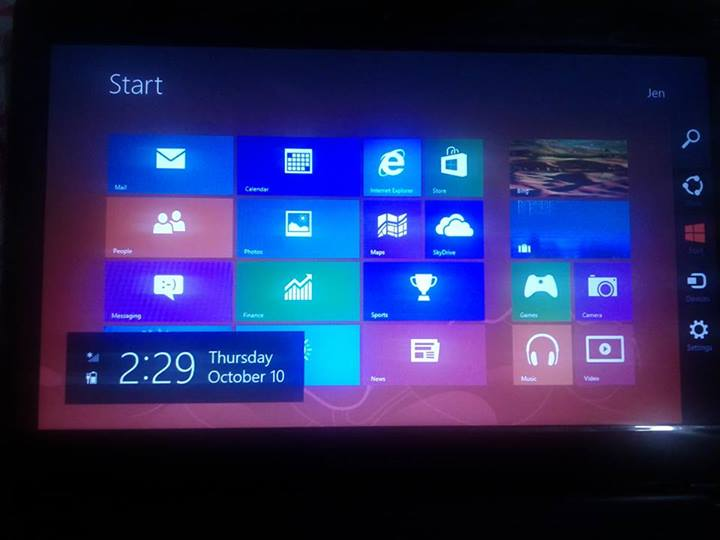

In preparation to the [Openness Night Hackathon this coming weekend](/blog/openness-night-24-hour-hackathon/), today, I worked around **Node.js app deployment on Heroku**. I'll be posting the procedures, challenges, and problems I encountered along the way by which could help anyone reading this who's also venturing this topic. Please mind that this is not an actual tutorial but I will provide links.

## So, why deployment first?

Yesterday, I gathered resources, tutorials and helpful articles and posted them on a Trello board (which I'll be sharing later on) and decided that I should first figure out how we will be deploying our app on the hackathon event.

If you would scale up the experiences I have with development, you would say I'm the front-end geek. But on this hackathon I signed up as the developer as they require one developer and one designer on their mechanics. Not to be confused with the roles of both, but I am the mastermind of the project so technically I'll be dealing with most of the backend stuff this time.

Since I can easily work around UX/UI, visual design, and CSS, I first tried to figure out how we would actually deploy our app online.

## Why Heroku?

I have frequently encountered [Heroku](https://www.heroku.com/) before and I learned it can host Node.js apps and supports [many other languages](https://devcenter.heroku.com/categories/language-support) as well. I also have learned about [Nodejitsu](https://www.nodejitsu.com/) along the way but I decided to first go with Heroku this time. Heroku also uses Git for deploying apps and I have my initial app mirrored on my GitHub account as well.

###### List of related articles:
- [Nodejitsu vs. Heroku for node.js Hosting](http://www.codebudo.com/2012/05/nodejitsu-vs-heroku-for-node-js-hosting/)
- [Heroku vs Nodejitsu vs Appfog](http://adamnengland.wordpress.com/2013/07/08/heroku-vs-nodejitsu-vs-appfog/)


## Node.js
I have installed [Node.js](http://nodejs.org/) and downloaded [npm](https://npmjs.org/) long ago but didn't actually had the right goal to use it. I started the [Node.js course on CodeSchool](https://trello.com/c/hqmSl9iK/5-real-time-web-with-node-js) last month but wasn't able to finish before my subscription expired, although I have downloaded the pdf for the whole course which pretty sums everything you need to know to start a Node.js project. I'll be providing the pdf later. Otherwise, the course familiarized me quite a bit with the syntax and code structure of Node.js.

So before deploying to Heroku, I first started to run the app locally. The first, and quite embarrasing thing is - I opened the [REPL](http://nodejs.org/api/repl.html) and typed the command in there. So when I happen to check the error online, [I got this](https://github.com/joyent/node/issues/2931): `LOL n00b! SYNTAX ERROR! TAKE THAT! HAHA!`

**Lesson learned: don't type `npm` commands on the REPL.**

Moving on, I know you could be laughing your ass right now but let me move on plz. :)

## Express, Socket.io, Ejs

I followed this article: [Deploying Your First Node.js and Socket.io App to Heroku](http://robdodson.me/blog/2012/06/04/deploying-your-first-node-dot-js-and-socket-dot-io-app-to-heroku/). So moving on with the REPL mistake, I installed [Express](http://expressjs.com/) on my Git Bash. :) Express is basically a web app framework for Node.js. Then after I created my project, I installed [Socket.io](http://socket.io/) which I still have little idea of its functionality but I'm gonna go with it.

**Why so many `node_modules` folders!?**

One of the initial challenges I encountered is understanding the file directory structure of Node.js and its modules. If you have installed Express and Socket.io for the first time you would notice `node_modules` folders on different hierarchies. The OCD in me grunches out and wanted to know if this is actually part of the structure or just duplicates. Turns out, node will automatically detect `node_modules` directories inside the project and will look for the modules in there. So technically, you should not rename it.

**The role of `package.json`**

Contextually, `package.json` is like the ``/_config.yml` on your Jekyll site. It contains the information for your Node.js project and it is very important to know that dependencies and their proper versions should be properly encoded to avoid conflicts.

```
	{
	    "name": "project-name",
	    "version": "0.0.1",
	    "private": true,
	    "dependencies": {
	      "express": "3.1.x",
	      "ejs": "~0.7.1",
	      "socket.io": "~0.9.6"
	  },
	  "engines": {
	    "node": "0.6.x"
	  }
	}
```

## Conflicts with versions

So while following the same article above by Rob Dodson, I encountered problems with the version of Express I installed with the sample `app.js` he posted.

Turns out that my version is Express 3 and his sample (considering his post is old) is for an older version of Express. See: [Migrating from 2.x to 3.x - visionmedia/express Wiki](https://github.com/visionmedia/express/wiki/Migrating-from-2.x-to-3.x).

**Here are some of the examples of the deprecated code:**

From line 2 of `app.js`:

		app = express.createServer(express.logger())


&raquo; `express.createServer()`` should be `express()`` on Express 3.

On line 37, `app.address().port` should just be simply `port`

**There's also compatibility issues with Socket.io:**

From `io = require('socket.io').listen(app)`` to `io = require('socket.io').listen(server)``.

**Aaaand with EJS: **

[EJS](http://embeddedjs.com/), a JavaScript templating library, also got some compatibility issues with Express 3. (Damn, Express 3.) [Layouts has been removed in Express 3](http://stackoverflow.com/questions/12616694/layouts-in-express-3-and-ejs). Good thing I found a workaround and used `ejs-locals` which you can get [here]([ejs-locals](https://github.com/RandomEtc/ejs-locals).

And so after making all the modules be friendly with each other, I got to run the app locally. Now we can move on with Heroku. **YAY!**

## Heroku

There's not much problems I encountered with deploying the app on Heroku. [Getting Started with Node.js on Heroku](https://devcenter.heroku.com/articles/getting-started-with-nodejs) pretty sums up the entire thing. Although for hours I can't get the app working properly online and was always showing an Application Error page. Turns out I just need to remove `server.listen(3000)``. _/facepalm/_

The file structure of my project looks a bit like this:

```
	project
	|_ node_modules
		|_ .bin
		|_ ejs-locals
		|_ ejs
		|_ express
		|_ socket.io
	|_ views
		|_ boilerplate.ejs
		|_ index.ejs
	|_ Procfile
	|_ app.js
	|_ package.json
```

Tomorrow evening we'll be attending the [Dev Boot Camp](https://opennessnighthackbootcamp.eventbrite.com/) for Windows 8 Application development. I'm still typing this post and I didn't realized it's already morning. And oh, my partner just got her Windows 8 installed:

<div class="Image__Small">
  
</div>

Time to party.

<hr />

##### Credits:
* Illustration by [Icons 8](https://icons8.com/illustrations/illustration/flame-the-start-up-launching) from [Icons8](https://icons8.com/)

<hr />
