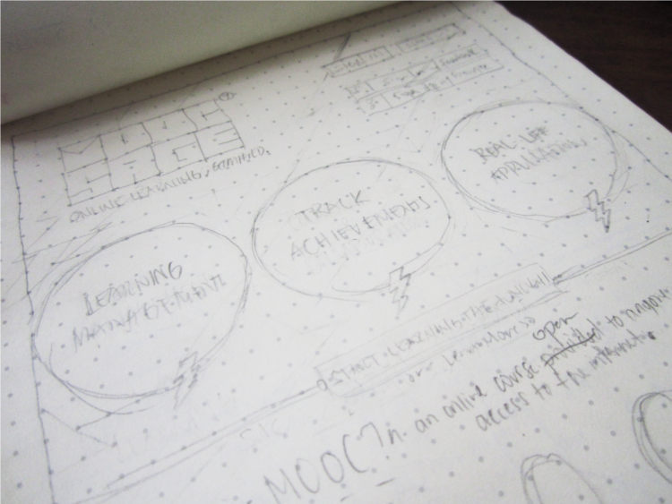
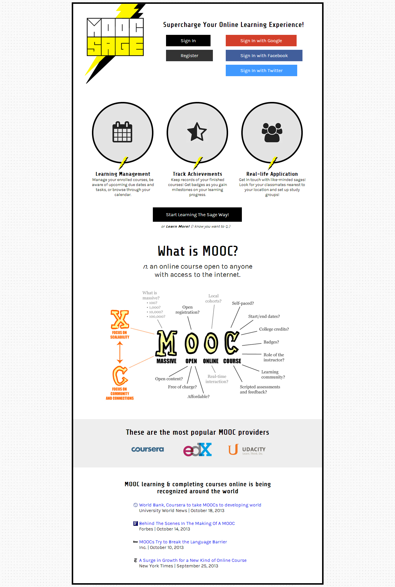
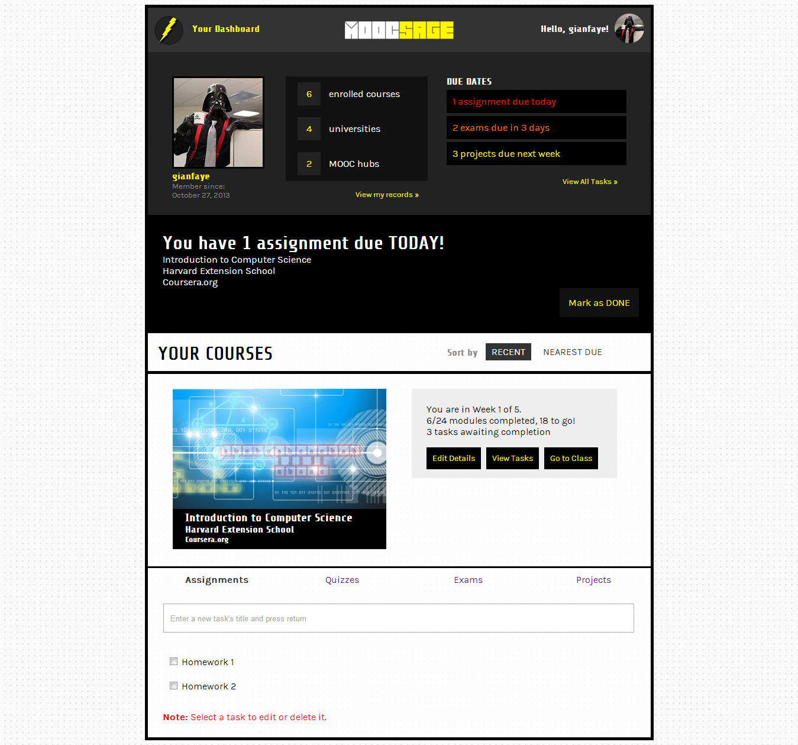

If you read some of my previous posts, I posted about me and my partner's preparation to the Microsoft Philippines Openness Hackathon which was moved to October 26 to 27.

#### Related Posts:
- [Openness Night: 24hr Hackathon](/blog/openness-night-24-hour-hackathon/)
- [Node.js Deployment on Heroku](/blog/hackathon-preparation-deployment/)
- [Windows 8 App Dev Boot Camp](/blog/windows-8-app-dev-bootcamp/)

First off, it was an overwhelming experience to be able to join the hackathon. It was my first hackathon and obviously (as I had so much fun) won't be the last. I'd like to thank my intern-gone-hackathon partner, Jennifer Arroyo, for sticking with me and sharing all the fun.

The most fun part is, having to bring your concepts and ideas to life. The app we developed it titled **MOOCsage**. If you are familiar with [MOOCs](http://en.wikipedia.org/wiki/Massive_open_online_course) or Massive Open Online Courses, this app is for those who take the courses on various MOOC providers and wanted to get all your learning materials and deadlines in one place.

  
  <figcaption>MOOCsage Home Draft</figcaption>

We went to the Azure Camp before the hackathon and learned to deploy apps to Windows Azure. We created our initial web app interface using Node.js and Backbone.js. To view the app, you can go to [moocsageapp.azurewebsites.net](http://moocsageapp.azurewebsites.net/) Here's some of the screenshots:

  
  <figcaption>MOOCsage Home Page</figcaption>

  
  <figcaption>MOOCsage Dashboard Page</figcaption>

The app won't just end there (hackathon) and we have decided even before we joined the hackathon that we'll be continuing developing and improving the app to make it in use and deliver it to my fellow MOOC sages. :)

##### Credits:
* Illustration by [Maria Shukshina](https://icons8.com/illustrations/author/5eb29f8301d0360018f18b01) from [Icons8](https://icons8.com/)

