If you may have read on [my previous entry](/blog/too-much-happenings), I resigned from my full-time position at The Fookien Times Yearbook Publishing Co, the mother company of [PULP Magazine](/project/pulp-magazine-live) and [PULP Live World Production](/project/pulp-live-world). However, I'll still be working part-time as their webmaster.

In this post, I'd like to dedicate some space in summarizing my 2-year experience working at PULP. **LIVE LOUD** is PULP Magazine's tagline.

**Some inside story how I got into PULP... **

Well, I was just browsing my Facebook feed and saw their post that they were looking for web developers to join them. I was not seriously looking for a job that time (I was still in Cavite) and I just tried since I'm into web development. And so I submitted my resume via email and got a prompt response for an interview.

Yikes, I had to travel for about 3 hrs and didn't know exactly where the office was. And I was not familiar with the places on Metro Manila that time because I lived in the province.

But hell to that, I was so excited because if you know me in high school, I am a song hits freak. **Song hits**, if you might remember, is what we call those music magazines with lyrics and guitar chords embedded on them. Although there are lots of open discussions whether song hits are to be considered as music magazines but you get the idea. And also not all of the chords are correct and we all made fun of it. But Internet killed the song hits and you can now easily search for the tabs and video covers on YouTube. Boohoo.

I'm an avid magazine collector. This is a picture of my music magazines and song hits collection back then (lower shelf), together with my books and other stuff (circa 2008):

  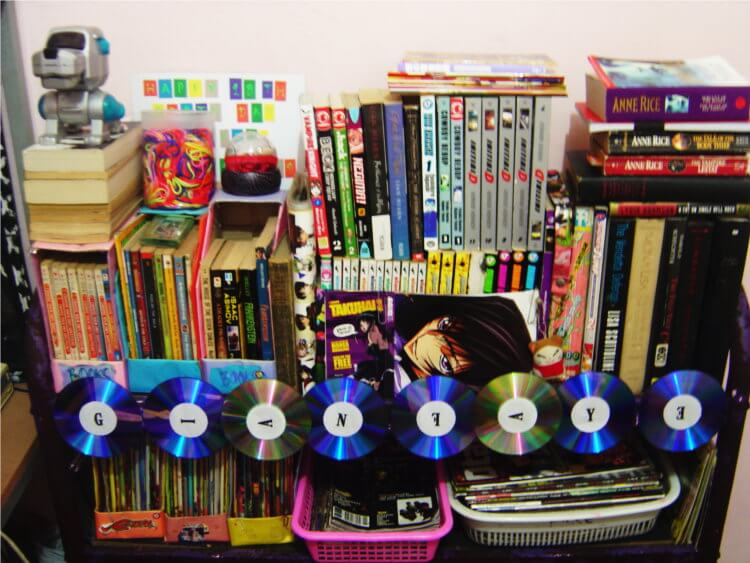
  <figcaption>Books and Magazine Collection Circa 2008</figcaption>

I was told during the interview that they got lots of resumes piled and they chose mine. Maybe it's the design of the resume that got their attention. It was actually inspired by David Malan's CV. If you are familiar with open courses, David Malan is a professor at [CS50: Introduction to Computer Science](https://cs50.harvard.edu/) at Harvard Extension School. He's my all-time favorite professor, by the way. :)

And so I got hired and...

## The Adventure Began

**11/19/2011** - 4 days after my first day on PULP, I got the opportunity to watch [Children of Bodom Live in Manila](https://www.facebook.com/media/set/?set=a.10150376409692896.358750.759167895&type=3&l=8c3042754a%C2%A0). This is a photo taken during the Meet &amp; Greet. Alexi Laiho is looking at me and Jaska Raatikainen is looking at the camera. Good times. Heh.

  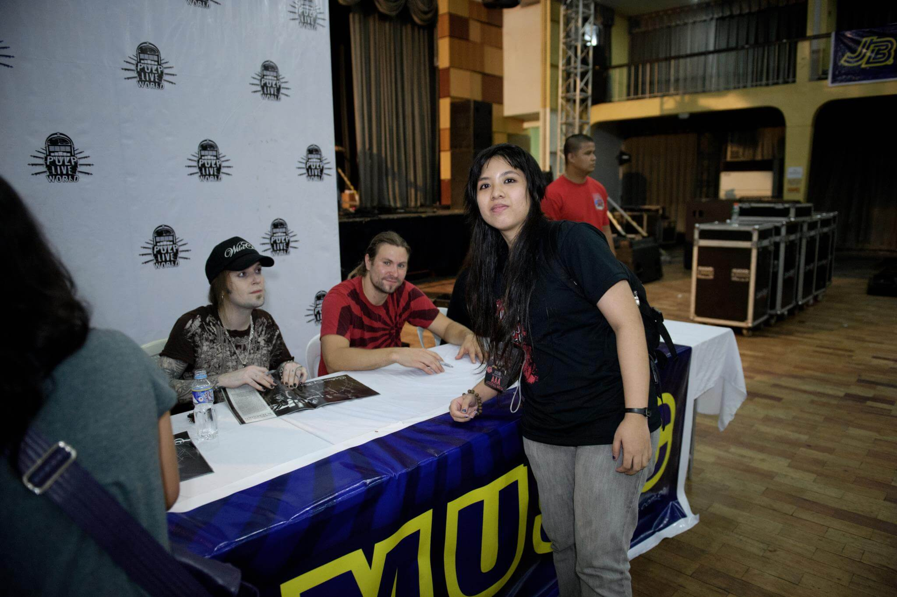
  <figcaption>Alexi Laiho (Vocalist) signing with Jaska Raatikainen (Drummer) of Children of Bodom</figcaption>

**11/28/2011** - The 2011 Philippines Yearbook Launch. As you have read above, The Fookien Times is the mother company of the PULP brand. I quite enjoyed this one though, it's a refreshing experience to see what these known people are up to during these type of events. Here's a photo of me with the hardworking ladies of Fookien Times.

  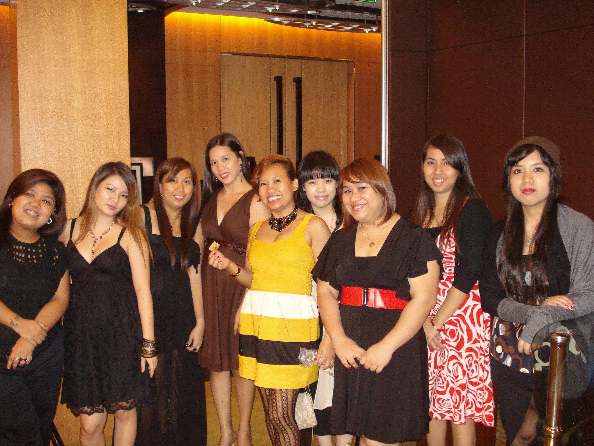
  <figcaption>The Fookien Times 2011 Philippines Yearbook Launch</figcaption>

**12/09/2011** - [Parkway Drive Live in Manila](https://www.facebook.com/gianfaye/media_set?set=a.10150417917862896.363364.759167895&type=3) is still the liveliest and most fun concert I've ever been to up to this date. These guys are the most humble guys we've met in history. Here's a photo of me with their frontman, Winston McCall.

  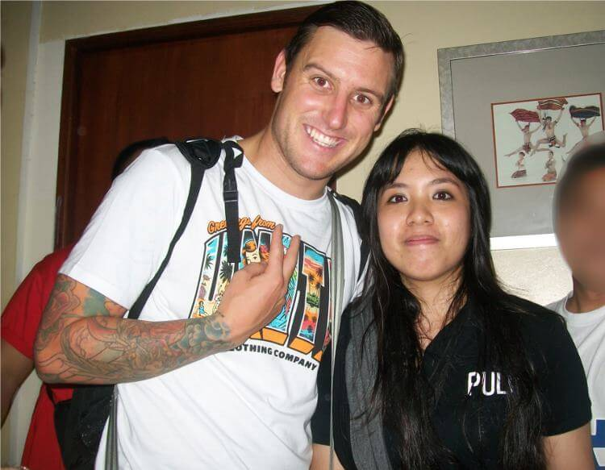
  <figcaption>Winston McCall, Vocalist of Parkway Drive</figcaption>

## 2012

**02/18-19/2012** - This is the start of the most exciting year ever, 2012. I got the opportunity to go with our road managers to assist [Lamb of God and The Black Dahlia Murder](https://www.facebook.com/gianfaye/media_set?set=a.10150561881467896.384435.759167895&type=3) on their concert last Feb. 18, 2012. I can say that this is one of the events I'll remember for the rest of my life. I also got the chance to join them on their after party and watch them do sorts of shit. Funny shit.

### Lamb of God

  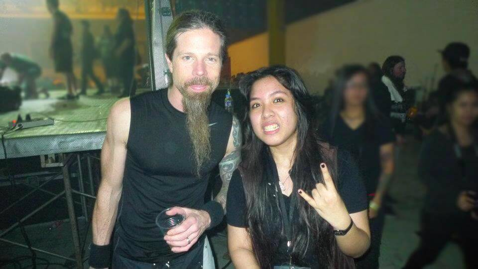
  <figcaption>Chris Adler,  Drummer of Lamb of God,   on the backstage</figcaption>

  
  <figcaption>John Campbell,   Bassist of Lamb of God,    on the backstage</figcaption>

  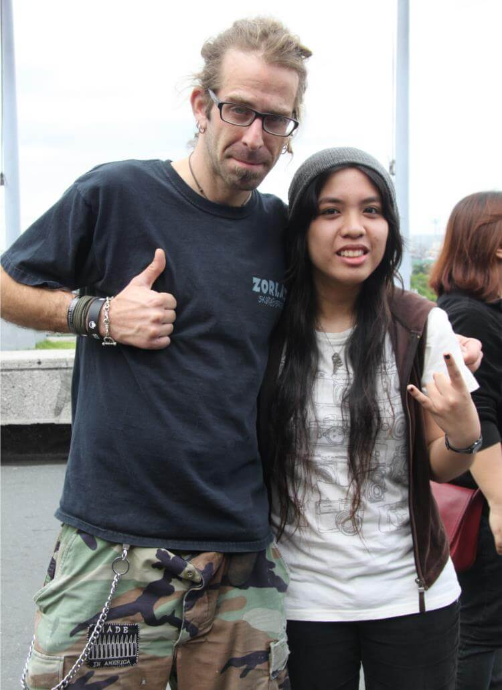
  <figcaption>Randy Blythe,    Vocalist of Lamb of God,    at the airport</figcaption>

### The Black Dahlia Murder

  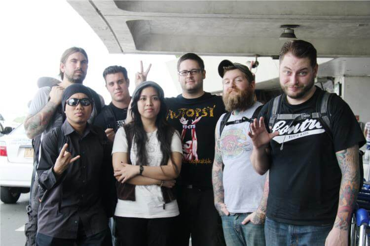
  <figcaption>The Black Dahlia Murder at the airport</figcaption>

**03/17/2012** - Following all the metal shows, we got [Cyndi Lauper Live in Manila](https://www.facebook.com/gianfaye/media_set?set=a.10150613408192896.392237.759167895&type=3).

### The PULP Crew

  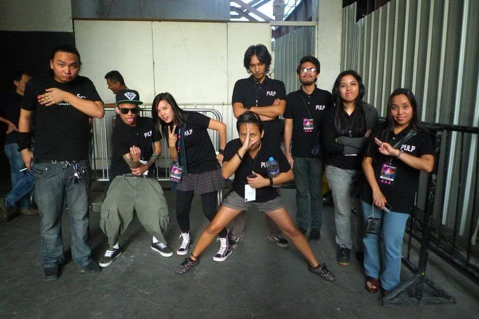
  <figcaption>The PULP Crew   on the backstage at   the Cyndi Lauper concert</figcaption>

**03/31/2012** - And then, [The Maine Live in Manila](https://www.facebook.com/media/set/?set=a.10150642006137896.396410.759167895&type=3).

**04/28-29/2012** - And the most awaited yearly music festival, PULP Summer Slam. I've been to PSS in the past: 2006, 2010, and 2011. The 2012 theme was The Apostles (following Christians' 12 apostles, I presume) where I got the chance to see [Arch Enemy, August Burns Red, Blessthefall, Darkest Hour, Periphery, and We Came As Romans](http://pulpliveworld.com/shows/summer-slam/pulp-summer-slam-12-the-apostles). I wasn't able to take proper photos as I was assigned with the road management of ABR and WCAR - although I fully admit I fail as a road manager. Haha. It was one of those tough experiences I'll always remember.

**06/02/2012** - [Set Your Goals, We Are The In Crowd, and This Century Live in Manila](http://pulpliveworld.com/shows/2012/we-are-the-in-crowd-this-century-set-your-goals)

**07/29/2012** - [Megadeth Live in Manila](http://pulpliveworld.com/shows/2012/megadeth)

### Dave Mustaine

  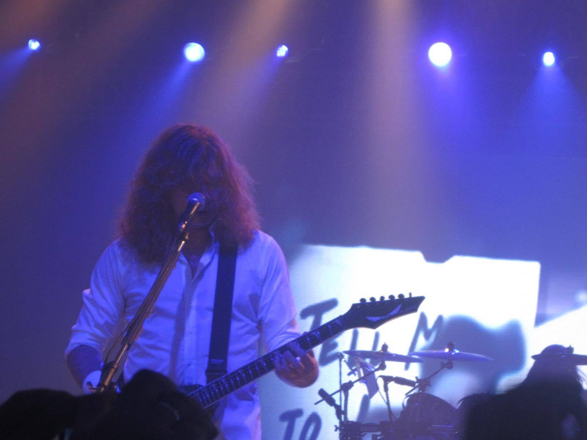
  <figcaption>Dave Mustaine,   Vocalist of Megadeth</figcaption>

  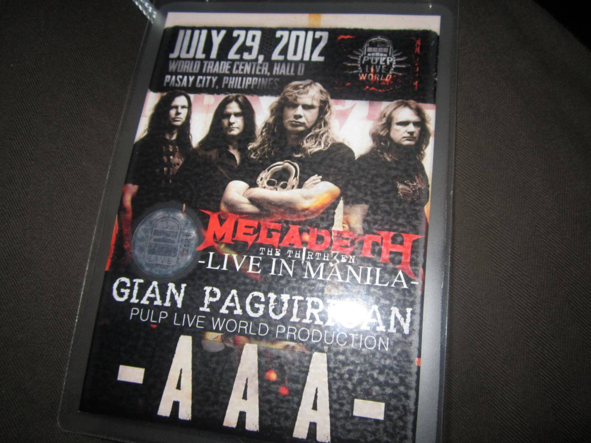
  <figcaption>Megadeth Live in Manila - All Access Area pass</figcaption>

**09/22/2012** - [Tonight Alive Live in Manila](http://pulpliveworld.com/shows/2012/tonight-alive)

**09/30/2012** - The [first BAZOOKA Rocks! Festival](http://pulpliveworld.com/shows/2012/bazooka-rocks) featuring The Pretty Reckless, A Skylit Drive, Mayday Parade, Marianas Trench, Forever The Sickest Kids, The Maine, The Wonder Years, Avastera.

Got the opportunity to have a photo with A Skylit Drive, Jagmin is missing from the photo.

  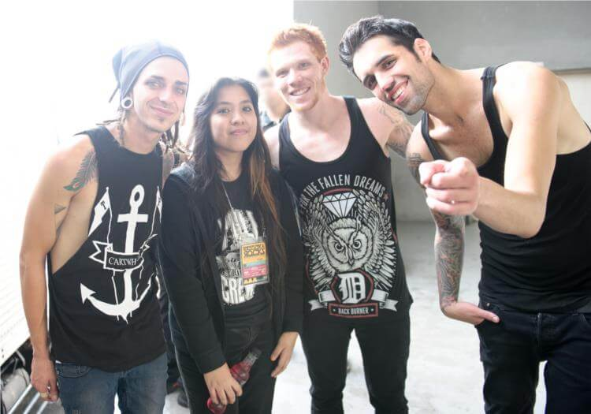
  <figcaption>A Skylit Drive,   at the back of the SMX Convention Center stage.     From Left to Right:   Cory La Quay (Drummer),   me, Nick Miller (Guitarist),   and Brian White (Bassist)</figcaption>

**11/06/2012** - The Modern Music Masters: [Mike Portnoy, Billy Sheehan, Derek Sherinian and Tony MacAlpine Live in Manila](http://pulpliveworld.com/shows/2012/portnoy-sheehan-sherinian-macalpine)

**11/28/2012** - 2012 Philippines Yearbook Launch with Stephen Bishop as guest performer

**12/09/2012** -  [This Century Live in Manila](http://pulpliveworld.com/shows/2012/this-century)

## 2013

**02/16/2013** - [Pierce The Veil and Sleeping With Sirens Live in Manila](https://www.facebook.com/media/set/?set=a.10151293283177896.467096.759167895&type=3)

  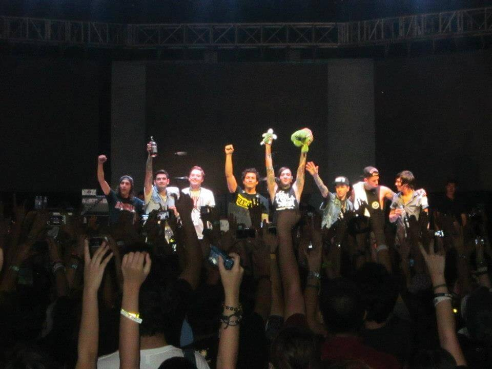
  <figcaption>Pierce The Veil and Sleeping With Sirens on the stage post-performance</figcaption>

Here's a photo of these two awesome guys from PTV. Hello, Jaime and Vic. Hehehe. Sorry for bugging you in the dressing room.

  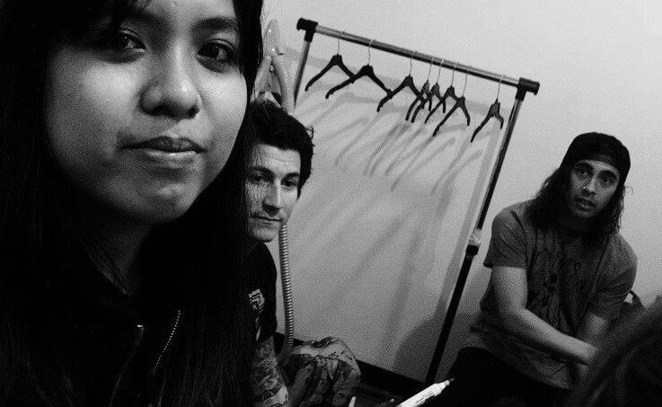
  <figcaption>Jaime Preciado (Bassist),  Vic Fuentes (Vocalist)  of Pierce The Veil</figcaption>

  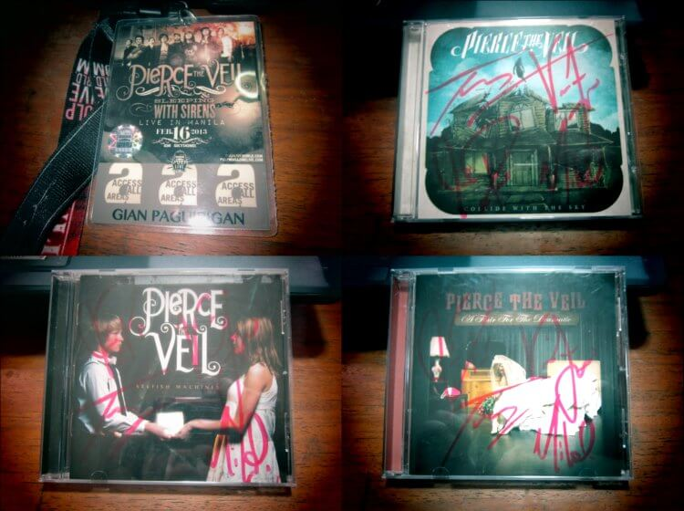
  <figcaption>Pierce The Veil Autograph</figcaption>

**03/06/2013** - [Bring Me The Horizon Live in Manila](http://pulpliveworld.com/shows/2013/bring-me-the-horizon)

  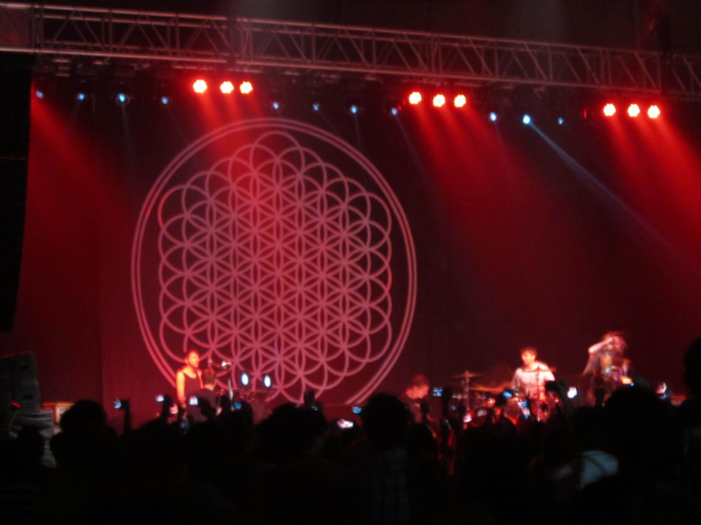
  <figcaption>Bring Me The Horizon Live in Manila</figcaption>

**04/27/2013** - It was the first time in the entire history of [PULP Summer Slam](http://pulpliveworld.com/shows/summer-slam/pulp-summerslam-13-til-death-do-us-part) that it rained this year. This year's lineup was Cannibal Corpse, As I Lay Dying, Dragonforce, Coheed &amp; Cambria, Circa Survive, A Skylit Drive, and Amoral.

**05/04/2013** - [SLASH with Myles Kennedy and the Conspirators Live in Manila](http://pulpliveworld.com/shows/2013/slash).

  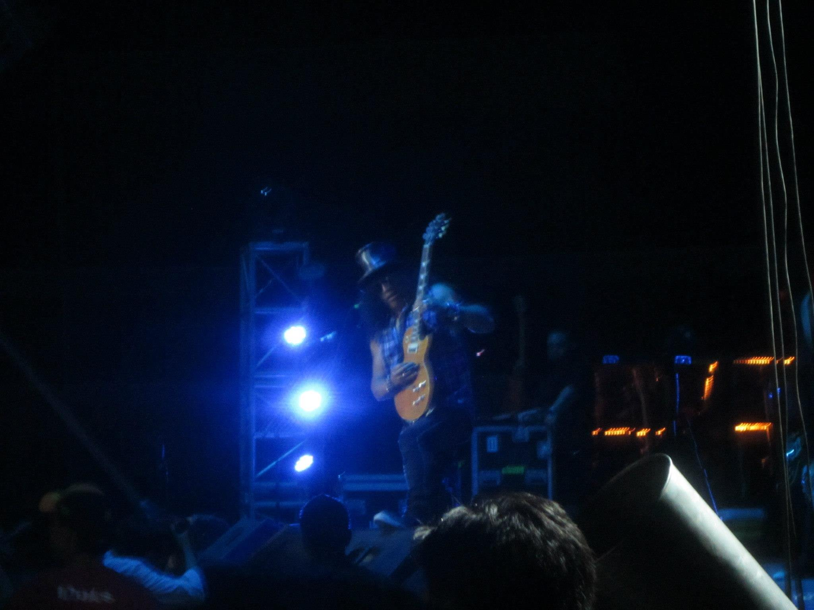
  <figcaption>SLASH with Myles Kennedy and the Conspirators</figcaption>

### PULP Crew with General Luna (front-act for SLASH)

  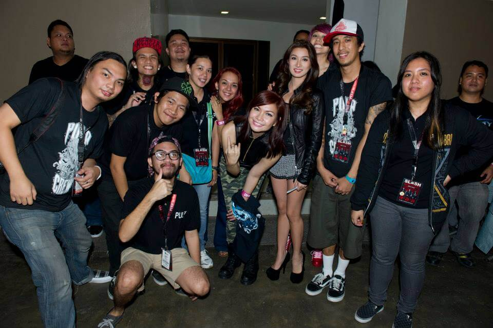
  <figcaption>PULP Crew with General Luna</figcaption>

**05/08/2013** - [Aerosmith Live in Manila](http://pulpliveworld.com/shows/2013/aerosmith)

  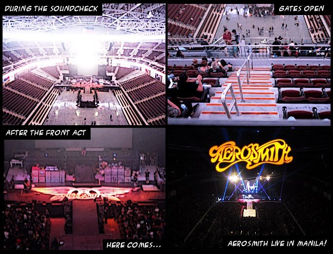
  <figcaption>Aerosmith Live in Manila</figcaption>

**07/31/2013** - [Killswitch Engage Live in Manila](http://pulpliveworld.com/shows/2013/killswitch-engage)

**08/25/2013** - [2nd BAZOOKA Rocks! Festival](http://pulpliveworld.com/shows/2013/bazooka-rocks) featuring All Time Low, Anberlin, Red Jumpsuit Apparatus, We Came As Romans, Tonight Alive, Radiodriveby, Uchusentai: NOIZ, A Rocket To The Moon

## Not an Ending

It's quite difficult to merge all the happenings on the span of 2 years within one post. I'm really grateful to be a part of the PULP Crew and this have always been a lifechanging episode.

It is not the number of concerts I've been to or the number of artists I got to see and interact with in real life. What I'll miss the most is the everyday fun of being a part of PULP family.

**LIVE LOUD!**

  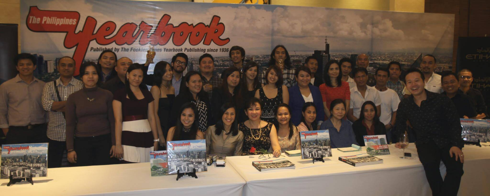
  <figcaption>The entire PULP Crew at The Fookien Times Philippines Yearbook Launch 2012 </figcaption>

##### Credits:
* Illustration by [Murat Kalkavan](https://dribbble.com/muratkalkavan) from [Icons8](https://icons8.com/)

