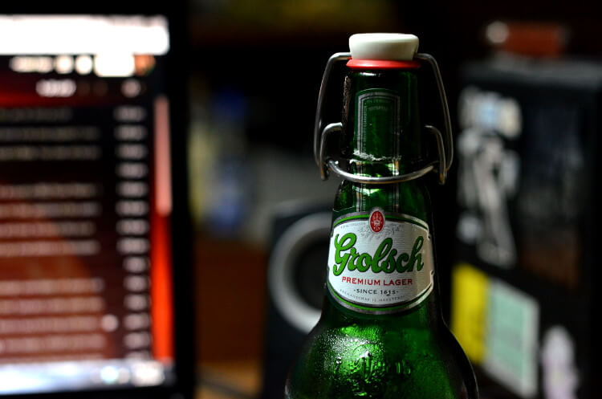
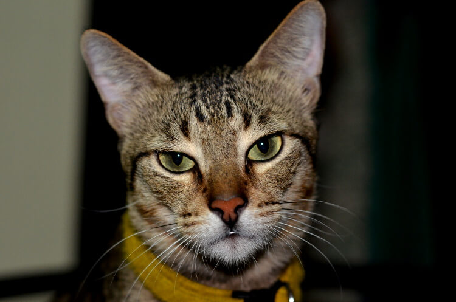
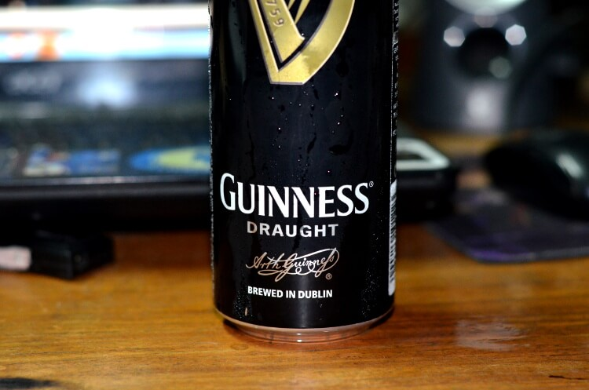
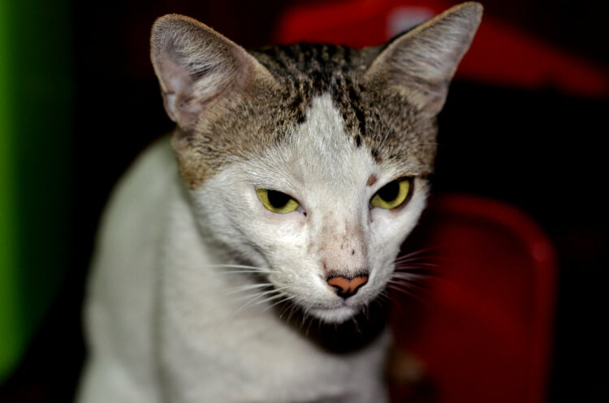
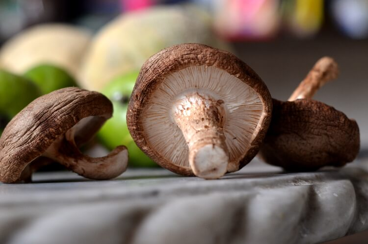
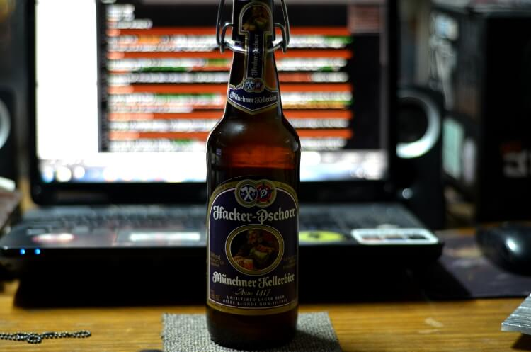
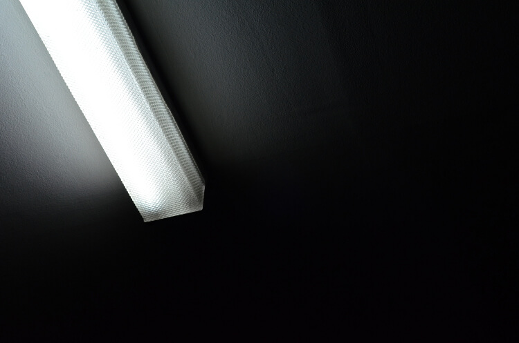

So we got this new DSLR, a Nikon D7000 and a 50mm AF f1.8D standard lens. I've been dying to have this opportunity to be able to take decent photos and this is a heaven-sent chance for me to say goodbye to poor mediocre photography. For all these years I've suffered enough taking horrible photos using point-and-shoot digital cameras and reminiscing good ole memories in grainy camera phone shots.

I am now starting to learn how to shoot properly.

Since photography is one of the most common hobbies since the boom of digital cameras, most are tempted to label themselves **photographers** whenever they get a chance to take photos. Or heck, the stereotypical pose-in-front-of-the-mirror-holding-a-DSLR and update their About Me with a pathetic attempt at being a **photographer** when they just got their new kit. I'm not heading for that. I just want to take decent photos.

Good thing for our generation, there's another heaven-sent gift. Obviously, Internet. Since it's a popular hobby, the Internet is full of photography tutorials and how-tos that made everyone's lives easier. One Google search and you'll save yourself the shame of not knowing what ISO means, or whatever the heck aperture is, and WTF are f-stops? And if you really need to know anything about exposure and shutter speed. But all these doesn't make sense unless you try it out and shoot something.

From what I read and have been advised by some friends who take photos professionally, I turned off auto focus and used manual focus instead. You know there's some kind of euphoria when you rotate the lenses to get a sharp focus. I sometimes do that with my eyes. Not sure if that was normal, though. Even when wearing prescription glasses, I can adjust my vision to blur then back to sharp again. Weird stuff.

Since I'm taking the vow and am starting as a n00b, I'm making this post as an initiation on my first attempt at shooting something decent. Maybe after a few months I'll get back to this post and spot mistakes and laugh at myself.

My subjects for this initial photoset are some of my favorite things in life - beer, cats, shiitake, and my room's light source.

 

  
  <figcaption>Grolsch Premium Lager   &copy; Gian Faye Paguirigan    NIKON D7000 &bullet; f/2.8 &bullet; 1/30 &bullet; ISO-1600 &bullet; 50mm</figcaption>

 

  
  <figcaption>My cat Ume   &copy; Gian Faye Paguirigan    NIKON D7000 &bullet; f/2.8 &bullet; 1/60 &bullet; ISO-1000 &bullet; 50mm</figcaption>

 

  
  <figcaption>Guinness Draught   &copy; Gian Faye Paguirigan    NIKON D7000 &bullet; f/2.8 &bullet; 1/60 &bullet; ISO-1600 &bullet; 50mm</figcaption>

 

  
  <figcaption>My cat Hitler   &copy; Gian Faye Paguirigan    NIKON D7000 &bullet; f/2.8 &bullet; 1/60 &bullet; ISO-1100 &bullet; 50mm</figcaption>

 

  
  <figcaption>Shiitake Mushroom   &copy; Gian Faye Paguirigan    NIKON D7000 &bullet; f/2.8 &bullet; 1/30 &bullet; ISO-800 &bullet; 50mm</figcaption>

 

  
  <figcaption>My cat Meo   &copy; Gian Faye Paguirigan    NIKON D7000 &bullet; f/2.8 &bullet; 1/30 &bullet; ISO-1600 &bullet; 50mm</figcaption>

 

  
  <figcaption>Hacker-Pschorr   &copy; Gian Faye Paguirigan    NIKON D7000 &bullet; f/2 &bullet; 1/15 &bullet; ISO-500 &bullet; 50mm</figcaption>

 

  
  <figcaption>Fluorescent   &copy; Gian Faye Paguirigan    NIKON D7000 &bullet; f/7.1 &bullet; 1/200 &bullet; ISO-2000 &bullet; 50mm</figcaption>

 

Now what I'm trying to figure out is how to extract EXIF data and include them on my posts without having to manually input them. Any suggestions on any existing technologies for this? I stumbled upon this repo: [jekyll-exiftag](https://github.com/benib/jekyll-exiftag) but [Github Pages](/colophon) won't allow plugins. &#x1F616;

Feel free to email me or hit the comments section below.

##### Credits:
* Illustration by [Icons 8](https://icons8.com/illustrations/illustration/clip-285) from [Icons8](https://icons8.com/)

