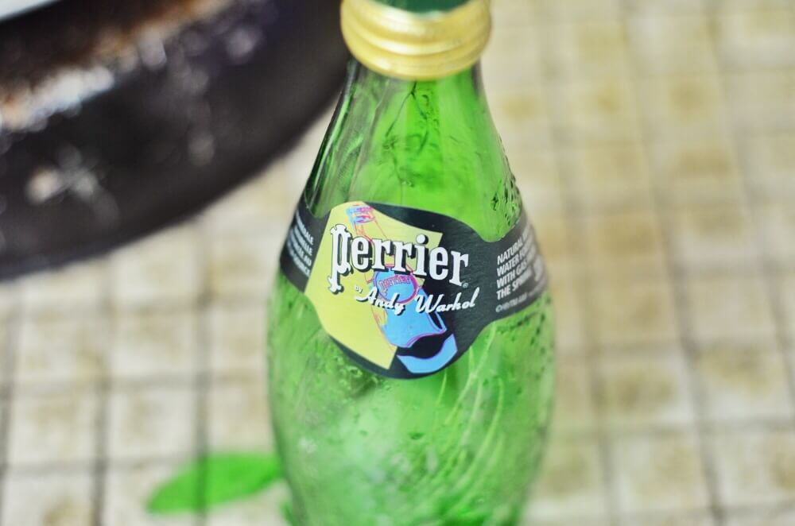

  
  <figcaption>Perrier mineral bottle featuring art    by Andy Warhol       &copy; Gian Faye Paguirigan    NIKON D7000 &bullet; f/2.5 &bullet; 1/25 &bullet; ISO-1000 &bullet; 50mm      Edited with Snapseed 1.6.1.0 iOS app</figcaption>

This is a broken bottle of Perrier mineral water refilled with purified water. When the mineral water bottle was put to freezer for days, it did not freeze. When the bottle was refilled with purified water and was put to freezer overnight, the water froze and the bottle broke. This shows that the freezing point of mineral water is lower than that of the purified water. So, when asked what's the freezing point of water, confirm which type of water is being asked first before answering 0&deg; Celsius - which is, as we were taught in elementary science, the freezing point of water. This does not apply for water with impurities. This phenomenon is called **Freezing Point Depression**.

###### List of sources:
- [Freezing Points of Bottled Water](http://forums.xkcd.com/viewtopic.php?f=18&t=17699)
- [Freezing Point Depression Definition](http://chemistry.about.com/od/chemistryglossary/a/freezingpointde.htm)

## How Did I Get Here?

I bought this bottle of [Perrier](http://www.forbes.com/sites/janelevere/2013/06/29/perrier-releases-limited-edition-mineral-water-bottles-inspired-by-andy-warhol/) for two reasons:

1. In [my previous post](/blog/mooc-summer-2014/) I mentioned that I'm taking up online courses at Coursera and one of them is [Warhol](https://www.coursera.org/course/warhol), an introduction to the life and work of Andy Warhol. That Andy Warhol tag on the bottle got my attention.
2. I like the shape of the bottle.

As I mentioned above, the bottle broke. &#x1F616; Obviously, I wanted to reuse the bottle. This made me wonder why it broke when I refilled the bottle with purified water and put it to freezer overnight, when it didn't break when I put the then mineral water in the freezer for days.

I had fun knowing why.

##### Credits:
* Illustration by [Icons8](https://icons8.com/illustrations/illustration/clip-248) from [Icons8](https://icons8.com/)

