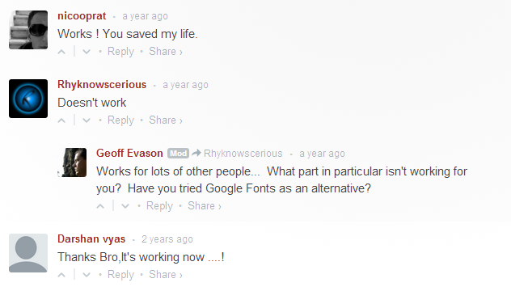

**"Doesn't work"** is a killer reply to every constructive tutorial, every comprehensive material, and every ingenious invention ever created.

It is an ignorant's way of saying *"yeah man I don't know how to use it so it doesn't work."*

Don't be that lazy not to even explain why it *"doesn't work"* and *"why it doesn't work only to you."*

>Ignorance is bliss only if the meaning of bliss is idiocy.

##### Credits:
* Illustration by [Ivan Haidutski](https://dribbble.com/Ivan_Haidutski) from [Icons8](https://icons8.com/)

