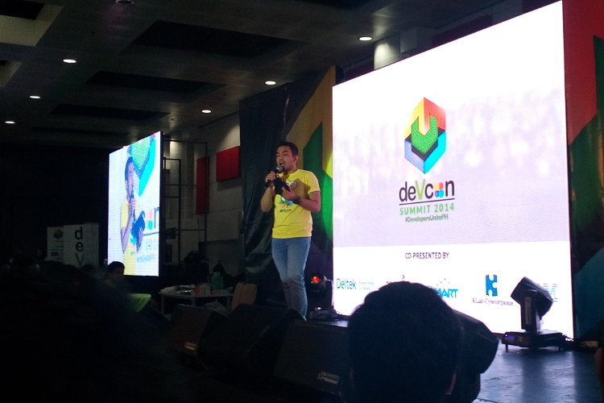
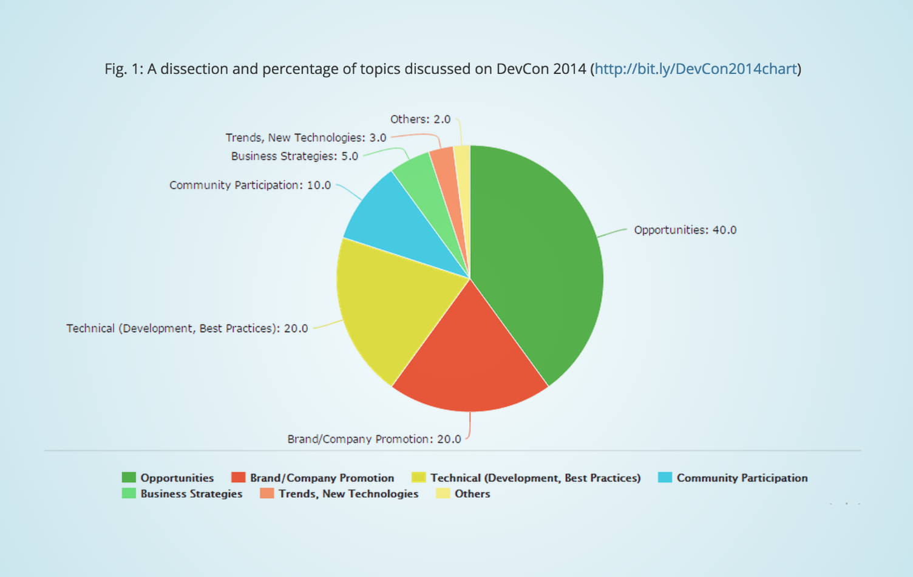

Last November 29 I participated on the [DevCon Summit 2014](http://summit.devcon.ph/2014/) that took place at the AlphaLand Southgate. It is quite an overwhelming experience to be surrounded by fellow developers while spotting some familiar faces. I saw my college professor, a few ex-coworkers, and awesome folks I follow online.

So let's get through with the topics...

Most of the event was covered with companies offering opportunities for developers seeking employment or change of, I understand that part of the audience are students looking for companies for their internships as well as fresh grads looking for their first job. This is fine with me considering I've been there. It's a quick overview of the things I've managed to walk through as well as a few things I should have known in the past.

One company tackled the difference between working as a freelancer versus as a full-time employee, with pros and cons for each. Although a bit biased as they are hiring full-time employees ;), a talk about getting noticed on E-lance and Odesk put an equilibrium to the atmosphere.

These are *nice-to-hear* talks if you are currently employed. Otherwise, a good reference for HR managers on how to get reach to and hire developers. (See, this event isn't just for developers.) Hence, this section of this post:

## Tips to reach and hire developers

**Participate on developer communities like DevCon.** It is useful to reach developers on their nest. Most developers attend conferences like DevCon to:

* Look for opportunities
* Learn from the masters
* Meet fellow developers
* Learn something new

**Minimize self-promotion.** When speaking to hundreds of developers, it is important to not only showcase who you are, what you do, but mostly how you can help them and give value to their career and learning. Some speakers obviously bored the audience due to overloaded self-promotion talks.

**Prepare a mindblowing reference of your company.** Your company image on print, online and personal reach should not indicate any signs of unprofessional touch. Developer conferences also reach designers. You should consider that the good and the best developers and designers have very keen eyes for details. If you want to hire the best, you should show them that you are the best. Your business cards should be mindblowing, your website should be decent, and the person appointed to reach the developers should also talk well. There's a case on the event where the speaker can't properly construct a sentence, doesn't know how to use grammatically correct words, and spoke Taglish. And you can hear the audience mumbling and correcting him. Not a good face for a brand.

**Show them what to expect on their work environment.** Developers are not just looking for a decent salary, they prefer that they can comfortably do their job (and can be very particular about this) so they need to know what to expect on the environment they're going into. Cubicles? Work from home? Free lunch? Name it.

* * *

## Technical (Development, Best Practices)

The main course of the event for the developers are the following technical talks:

* **Android** by Evan Dale Aromin, Philippine Android Developers Community
* **iOS** by Allen Tan, White Widget
* **Windows Phone** by Joben Rara, Microsoft Philippines
* **Bluemix for the Web** by Alexis Pantola, IBM Philippines
* **The "What" and "Why" of NoSQL** by Matias Cascallares, MongoDB
* **Introducing FB Mobile BUILD solutions and FbStart** by Calvin Kim, Facebook
* **Automated Testing** by JV Cuevas, Deltek
* **Git & GitHub Best Practices** by Sim Domingo, GitHub

### On Android, iOS, and Windows Phone
The audience were asked to raise their hands if they are developing for the web, and if they are developing for mobile. Almost all of the developers who raised their hands are developing for the web, and only a few raised that they are developing for mobile. The speaker was surprised to know this and disclosed that almost all countries he has spoken to are on the mobile development track. This raised a concern that the Philippine developer communities are still behind on the mobile-first movement.

### On Automated Testing
The speaker shared the advantages of using automated testing on the development cycle. He also shared the best automation tools to use: MS CodeUI (Microsoft), Quick Test Professional (HP), Selenium (Open Source), JUnit / NUnit (Unit Testing), eggPlant (Test Plan), SoapUI (Web Services)

### On Git and Github Best Practices
The highlight of this talk is applicable not just for Git but also for managing source codes versions in general. Here are the tips from Sim Domingo, Github:

* **Commit often.**

* **Commit messages should be as specific as possible.**
  Bad examples: "Final css", "Edit layout",  "this is a new feature"
  Good examples: "Fix defect #124", "Adjust height of slider on home", "Implement autofocus on contact form"

* **Update (SVN) or Pull (Git) often.** It is important to make sure that the developer's local or individual copy/repository is updated to prevent conflicts

* * *

## Business Strategies (cross-over) Technical

* **How Technical Debt Can Ruin A Business** by Calen Legaspi, Orange and Bronze Softare Labs, Inc.

This keynote is probably **the best of DevCon 2014 Summit**. It highlights how bad code quality and neglected unit tests can affect your business. The talk served as an eye-opener to most of the developers, including me, that code quality isn't just so other developers can understand your code - but the costs of maintaining the code and its great impact onto saving or wasting your business resources.

### How to not let Technical Debt ruin your business:

* Refactor Mercilessly
* Practice Test-Driven Development
* Obsess on Readability
* Practice Domain-Driven Design
* Be a Scholar of Coding Practices & Design

Blog post: [http://calenlegaspi.blogspot.com/2014/12/my-technical-debt-presentation-at.html](http://calenlegaspi.blogspot.com/2014/12/my-technical-debt-presentation-at.html)

Slides: [http://techdebt.appspot.com/](http://techdebt.appspot.com/)

* * *

## Community Participation

If you live under the rock, you would be surprised to know we have quite a round of active developer communities in the Philippines. The following encouraged developers to engage in community activities and hone well-rounded skills from specialized experts:

* PHP User Group Philippines (PHPUGP)
* Philippine Ruby User Group (PHRUG)
* Drupal Pilipinas
* PythonPH
* Philippine .NET User Group (PHINUG)
* International Game Developers Association (IGDA)
* Philippine Web Design Organization (PWDO)
* Philippine Aerospace Development Corp. (PADC)
* Google Developers Group (GDG)
* MozillaPH

* * *

## Trends / New Technologies

Also, one of my favorite talks is the **Bluemix for the Web** by Alexis Pantola, IBM Philippines where IBM Watson was introduced.

Link: [http://www.ibm.com/smarterplanet/us/en/ibmwatson/](http://www.ibm.com/smarterplanet/us/en/ibmwatson/)

This is a very powerful tool for research and community-powered statistical knowledge-base.

### Internet of Things (IoT)
Although already being familiar with the term, this is still a new player in the development industry.

* * *

**That's it!**

The summit is a refreshing take on the current developer culture, how the industry is leading when it comes to endless opportunities, and being informed and up-to-date with development best practices and new technologies.

I also created a slide on Slides.com for this event, [check it out](http://slides.com/gianfaye/devcon-summit-2014-summary#/).

