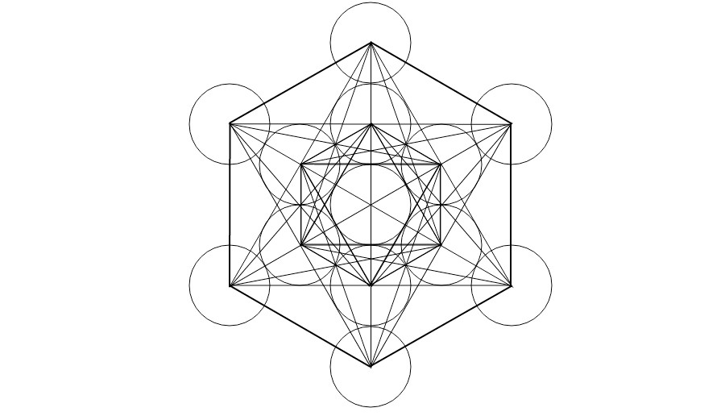

This is my initial trial of [Sketch App](http://www.sketchapp.com/) by Bohemian Coding. I haven't read or watched any tutorials for Sketch for the purpose of testing how user-friendly the app would be for a new user. I'm an avid [GIMP](https://www.gimp.org/) user and I will be applying what I'm already familiar with in terms of the common graphic design tools.

For this example, I'll be showing you how to create the [Metatron's Cube](http://www.sacred-geometry.es/?q=en/content/metatrons-cube) on Sketch App. I used Google Hangouts for the recording and just selected a free audio sample from YouTube that's why you will only hear the audio in the beginning. I didn't bother to edit the recording to fast-forward as you can set it under `Settings > Speed > 2` on the video itself. Enjoy!

  <YouTube videoId="LDafW_BP5Lo" />
  <figcaption>Sketch app initial trial: Sacred Geometry sample</figcaption>

## Result

  
  <figcaption>Sacred Geometry: Metatron's Cube</figcaption>

Completed in less than 30 minutes. Still needs a little polishing but not bad for the first trial.
