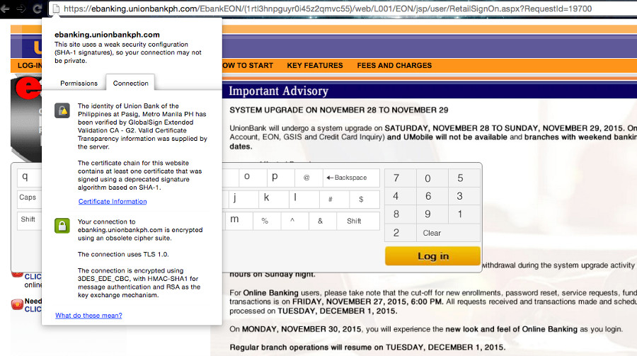
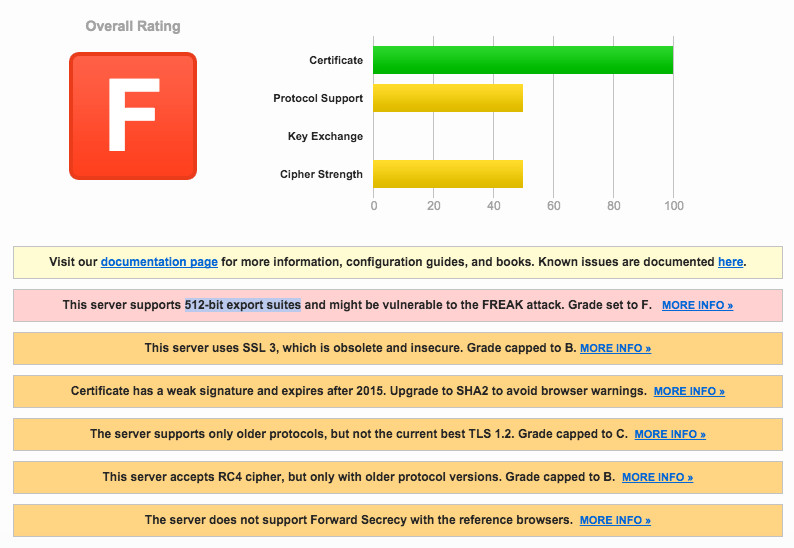
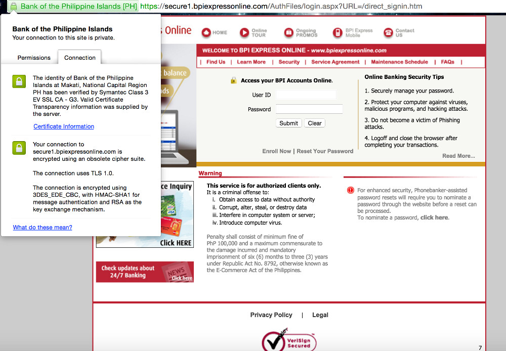
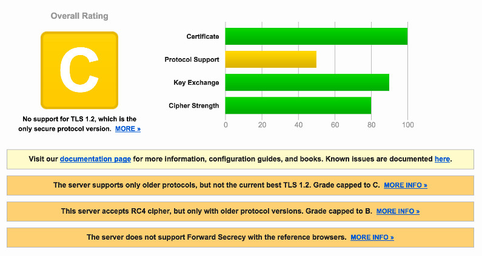
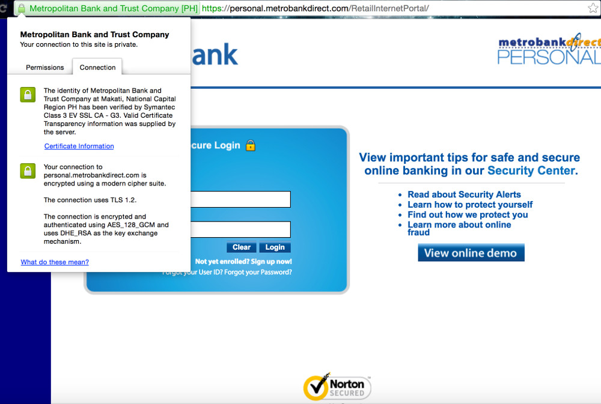
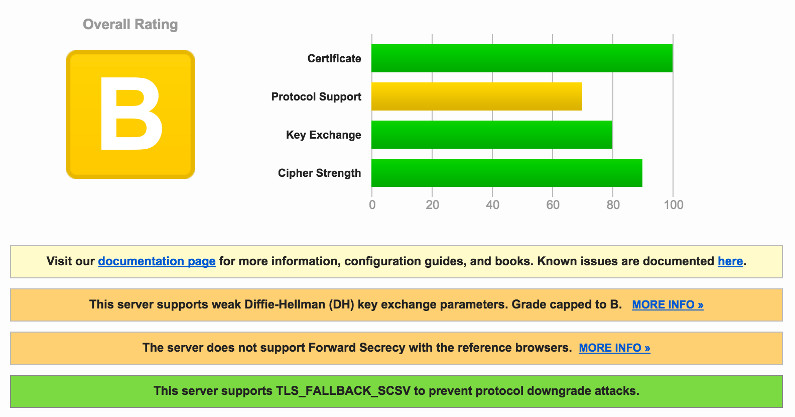
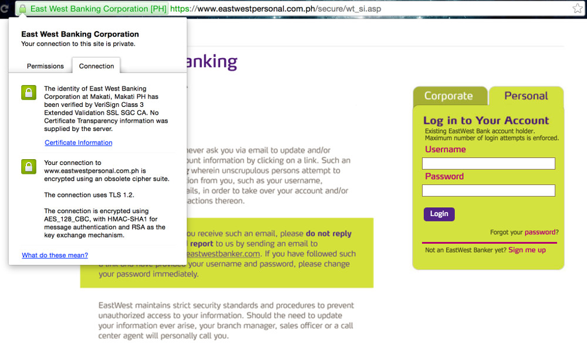
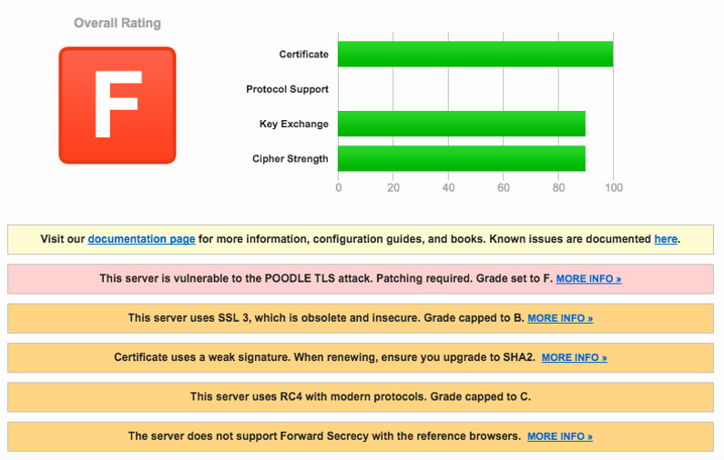
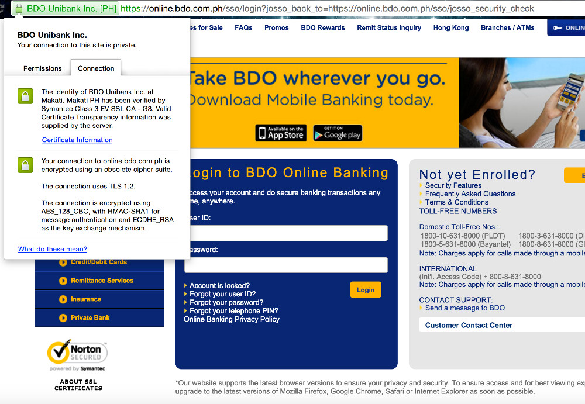
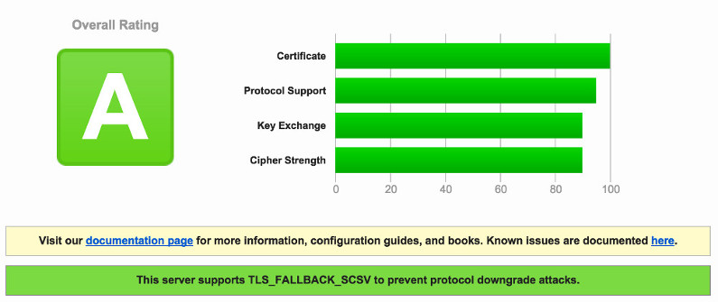

This post is a collation of articles and other references backing up a personal research about the current state of security of Philippine online banking portals. The purpose of this research is mainly educational and encouraging awareness of our online activities — one of which is online banking.

_Disclaimer: I am no expert in Information Security or Cybersecurity and I have minimal technical knowledge of the aforementioned fields as of this typing. If you are an expert on any of these fields and you have any concerns or additional input, feel free to post on the comments section below._

The main goal for this research is to answer this question:

> Is your online banking secure enough?

**Cybersecurity**, or security in general, is a *cat-and-mouse* chase. Each day, software vulnerabilities and security holes are found, reported, and patched. But sometimes, [a mouse can outsmart the cat](https://en.wikipedia.org/wiki/Zero-day_(computing)). Attackers can find and exploit these vulnerabilities before they could be known and fixed by a patch. The users of the system will always be the victims.

There are techniques and technologies that help secure a system. The crucial part to keeping a system secure is to always use the latest release of these technologies as most likely the reason for the release would be a security patch to fix a recently discovered vulnerability.

What happens when the system you are using does not follow this practice? Well, it is like sending [an open invite to attackers](http://www.rappler.com/life-and-style/technology/42792-anonymous-hacks-ombudsman-government-websites).

For this research, I will make examples of banks I can think of while writing this. I will use Google Chrome for checking the details of my connection to the following online banking portals and [Qualys SSL Labs](https://www.ssllabs.com/index.html) scanner for a deeper review. Technologies such as encryption, cryptography, and protocols will be the main basis for this research.

## UnionBank

The main portal for personal banking is under this domain: _ebanking.unionbank.ph_

**"This site uses a weak security configuration (SHA-1 signatures), so your connection may not be private."**

**"The certificate chain for this website contains at least one certificate that was signed using a deprecated signature algorithm based on SHA-1."**

**SHA-1** has been vulnerable [since 2005](https://www.schneier.com/blog/archives/2005/02/sha1_broken.html). More info [here](https://en.wikipedia.org/wiki/SHA-1#Attacks) and the full report on [this document](http://eprint.iacr.org/2005/010.pdf). Security experts recommend [SHA-2 or SHA-3](https://www.schneier.com/blog/archives/2015/10/sha-1_freestart.html).

"Microsoft, Google and Mozilla have all announced that their respective browsers will stop accepting SHA-1 based SSL certificates by 2017 (and that SHA-1-based certificates should not be issued after 2015). In conclusion, our estimates imply SHA-1 collisions to be now (Fall 2015) within the resources of criminal syndicates, two years earlier than previously expected and one year before SHA-1 will be marked as unsafe in modern Internet browsers. This motivates our recommendations for industry standard SHA-1 to be retracted as soon as possible." - [The SHAppening: freestart collisions for SHA-1](https://sites.google.com/site/itstheshappening/)

**"The connection uses TLS 1.0."**

**TLS 1.0**? Is there an acceptable reason why an online banking portal uses an older protocol? Funny how there's a saying circulating the InfoSec community: _"You don't have to be a bank to upgrade your TLS implementation."_ Perhaps, the 'bank grade security' IRL doesn't apply online? Hmmm...

TLS 1.0 has been introduced in ...wait for it... 1999! _\*badum-tss\*_ The newer protocols are TLS 1.1 (released 2003) and TLS 1.2 (released 2008). And browsers started supporting TLS 1.2 since 2013 with almost all modern browsers supporting it by 2014. Why so behind? Just why?

UnionBank's server also uses SSL 3. If you are not yet aware why this is a red flag, I'll save the explanation for later on another bank who also implemented SSL 3. (<a href="https://www.youtube.com/watch?v=_4IRMYuE1hI" target="_blank">Click me.</a>)

**"Your connection to ebanking.unionbankph.com is encrypted using an obsolete cipher suite."**

The server accepts the RC4 encryption algorithm by which multiple vulnerabilities are found and can be exploited by the following attacks:

* [Fluhrer, Mantin and Shamir attack](https://en.wikipedia.org/wiki/Fluhrer,_Mantin_and_Shamir_attack) (2001)
* [Klein's attack](https://en.wikipedia.org/wiki/RC4#Klein.27s_attack) (2005)
* [Royal Holloway attack](https://en.wikipedia.org/wiki/RC4#Royal_Holloway_attack) (2013)
* [Bar-mitzvah attack](https://en.wikipedia.org/wiki/Bar-mitzvah_attack) (2015)
* [NOMORE attack](https://www.rc4nomore.com/) (2015)

I planned to save negative remarks to myself but _dear lord_ -- UnionBank's server also supports 512-bit export suites -- plain RSA. [Any less than 2048-bit is considered weak.](https://www.rapidssl.com/2048-bit-certificate-compliance/) To put it bluntly, this is undoubtedly A VERY UNSECURED SITE. This obsolete cipher suite is obsolete for many reasons: one of them is being susceptible to the **FREAK attack**. ["It allows an attacker to intercept HTTPS connections between vulnerable clients and servers and force them to use weakened encryption, which the attacker can break to steal or manipulate sensitive data."](https://freakattack.com/) Meaning, if an attacker knows you do online banking at UnionBank, they can [act as a middleman](https://en.wikipedia.org/wiki/Man-in-the-middle_attack) between you and the website and do whatever they want with your data.

**UnionBank Security: DANGER ZONE.** <small>[[Full Report](/assets/docs/security-report-ebanking-unionbankph.pdf) | [Latest Scan](https://www.ssllabs.com/ssltest/analyze.html?d=ebanking.unionbankph.com&s=203.82.36.182)]</small>

## Bank of the Philippine Islands

The main portal for personal banking is under this domain: _secure1.bpiexpressonline.com_

BPI uses the TLS 1.0 protocol using cipher block chaining (CBC) for encryption.

Again, the only secure protocol version is [TLS 1.2](https://www.entrust.com/moving-tls-1-2/). Older protocols have known vulnerabilities. TLS 1.0 using CBC-mode for encryption is open to the [Lucky 13 attack](http://www.isg.rhul.ac.uk/tls/Lucky13.html). Their server also accepts the RC4 cipher for which, as I cited above, is vulnerable to a number of attacks since 2001.

**BPI Security: UNSECURED.** <small>[[Full Report](/assets/docs/security-report-secure1-bpiexpressonline.pdf) | [Latest Scan](https://www.ssllabs.com/ssltest/analyze.html?d=secure1.bpiexpressonline.com)]</small>

## Metrobank

The main portal for personal banking is under this domain: _personal.metrobankdirect.com_

Good news, Metrobank users. As you can see on the screenshot, the site uses the latest protocol: TLS 1.2, a modern cipher suite: DHE_RSA with AES_128_GCM, and RSA 2048-bit key for encryption.

The Metrobank server supports Diffie-Hellman (DH) key exchange parameters where a weakness has been uncovered and is prone to the Logjam attack. ["The Logjam attack allows a man-in-the-middle attacker to downgrade vulnerable TLS connections to 512-bit export-grade cryptography."](https://weakdh.org/) And as I mentioned above, any key lower than 2048 bits is weak. However, their server also supports TLS_FALLBACK_SCSV to [prevent protocol downgrade attacks](http://www.exploresecurity.com/poodle-and-the-tls_fallback_scsv-remedy/). Good job, Metrobank.

**Metrobank Security: SECURE.** <small>[[Full Report](/assets/docs/security-report-personal-metrobankdirect.pdf) | [Latest Scan](https://www.ssllabs.com/ssltest/analyze.html?d=personal.metrobankdirect.com&s=210.213.81.109&latest)]</small>

## EastWest Bank

The main portal for personal banking is under this domain: _www.eastwestpersonal.com.ph_

As you can see, EastWest Bank is using the latest protocol: TLS 1.2. Disappointingly, like UnionBank, they also use SSL 3, which is an 18-year-old obsolete technology. With the SSL 3 implementation, even with TLS 1.2, EastWest Bank's banking portal is susceptible to the [POODLE attack](https://community.qualys.com/blogs/securitylabs/2014/10/15/ssl-3-is-dead-killed-by-the-poodle-attack). ["This vulnerability allows the plaintext of secure connections to be calculated by a network attacker."](https://googleonlinesecurity.blogspot.com.au/2014/10/this-poodle-bites-exploiting-ssl-30.html) Meaning, logging in on this site is unsafe. Attackers can steal your username and password and exploit your data. More info about the POODLE attack [here](https://www.openssl.org/~bodo/ssl-poodle.pdf). They SHOULD DISABLE SSL 3 on their servers as soon as possible. If disabling it is out of the picture for some reason, the remedy would be to implement the TLS_FALLBACK_SCSV mechanism like what Metrobank did.

They are also using SHA1 signatures with plain RSA as the encryption key in CBC-mode with RC4 cipher suite. And as I mentioned on the previous reviews, all vulnerable to known attacks.

**EastWest Bank Security: DANGER ZONE.** <small>[[Full Report](/assets/docs/security-report-eastwestpersonal-com.pdf) | [Latest Scan](https://www.ssllabs.com/ssltest/analyze.html?d=eastwestpersonal.com.ph&s=203.177.229.123)]</small>

## Banco de Oro

The main portal for personal banking is under this domain: _online.bdo.com.ph_

BDO is using the latest protocol: TLS 1.2 but Chrome reported that the site is encrypted using an obsolete cypher suite. The main trigger for this warning is the AES_128_CBC cipher.

On [Chromium Security standards](https://www.chromium.org/Home/chromium-security/education/tls), 'modern' cryptography entails:

* TLS 1.2 (protocol)
* AES_128_GCM or CHACHA20_POLY1305 (cipher suites)
* DHE_RSA or ECDHE_RSA or ECDHE_ECDSA (key exchange)
 

##### Related link: [Google Chrome “Your connection to website is encrypted with obsolete cryptography”](http://security.stackexchange.com/questions/83831/google-chrome-your-connection-to-website-is-encrypted-with-obsolete-cryptograph) on Information Security StackExchange

Notice the difference on the second item: *CBC* refers to cipher block chaining and *GCM* to Galois/Counter Mode.

GCM is another [mode of operation](https://en.wikipedia.org/wiki/Block_cipher_mode_of_operation) that is an [authenticated encryption algorithm](https://en.wikipedia.org/wiki/Authenticated_encryption) while CBC is a common mode.

And as previously mentioned, CBC-mode in TLS 1.0 is susceptible to the Lucky 13 attack. However, another variation of the POODLE bug has been uncovered late 2014 that also affected TLS implementations with CBC-mode encryption. [TLS 1.2 is reported safe](https://community.qualys.com/blogs/securitylabs/2014/12/08/poodle-bites-tls) from this attack.

As an additional layer of security, BDO also supports TLS_FALLBACK_SCSV.

**BDO Bank Security: SAFE AND SECURE.** <small>[[Full Report](/assets/docs/security-report-online-bdo-com.pdf) | [Latest Scan](https://www.ssllabs.com/ssltest/analyze.html?d=online.bdo.com.ph&s=203.177.92.11)]</small>

In summary:

* Two banks are graded SECURE: **Metrobank** and **Banco de Oro** -- Safe to use for online banking.

* One bank is graded UNSECURED: **Bank of the Philippine Islands** -- Use caution when entering sensitive data.

* Two banks are graded as DANGER ZONES: **Unionbank** and **EastWest Bank** -- Not safe to use.

If you have questions, objections, requests, suggestions, or concerns, feel free to start a discussion on the comments section below.

**Be safe online.**

##### Credits:
* Illustration by [Icons 8](https://icons8.com/illustrations/illustration/hugo-information-security) from [Icons8](https://icons8.com/)

