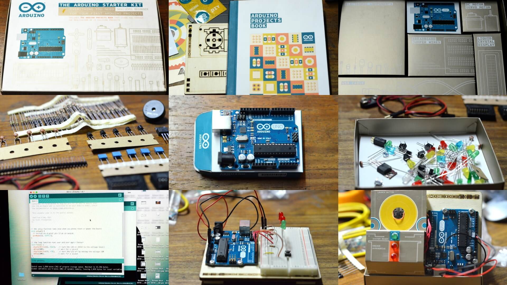

[Arduino](https://www.arduino.cc/) is an open-source prototyping platform based on easy-to-use hardware and software. Arduino boards are able to read inputs - light on a sensor, a finger on a button, or a Twitter message - and turn it into an output - activating a motor, turning on an LED, publishing something online. You can tell your board what to do by sending a set of instructions to the microcontroller on the board.

I got my [Arduino Starter Kit](https://www.arduino.cc/en/Main/ArduinoStarterKit) at PC Options Gilmore for `6,700php`. This kit includes an Arduino Projects Book with 15 projects ready to make, an [Arduino UNO board](https://www.arduino.cc/en/main/arduinoBoardUno), and components that will be used to create the projects.

## Unboxing the Arduino Starter Kit

Here are the photos I took while unboxing:

  
  <figcaption>Unboxing the Arduino Starter Kit</figcaption>

The last photo is for the 2nd project on the book called *Spaceship Interface*.

If you have minimal background with electronics, you might have to thoroughly read all of the parts of the kit and how they work before initiating any of the projects included on the book.

## Making the LED light

The basic of the basics -- when the button is pressed `switch = ON` the current flows to the LED and it will turn on.

## Series Circuit

You know the drill. Both switches need to be turned ON for the current to flow to the LED. As cliche as the example goes: this has been used for old Christmas lights and when a bulb isn't working, all of them won't work.

## Parallel Circuit

Either of the switch can be turned ON for the current to flow. Modern Christmas lights use this so even if a bulb is burned out, the other working bulbs still light up.

After that, you have to download the [Arduino IDE](https://www.arduino.cc/en/Main/Software) for you to start telling what the board should do. If you have a programming background, the syntax is quite similar to C. In Arduino, a program is called a *sketch*.

## Spaceship Interface

This is a cool starter project for you to understand the basic syntax of the Arduino sketches, INPUT and OUTPUT, variables, and the conditionals.

## My name in Morse code

I got way excited and modified the script a little for it to show my name in Morse Code after I switched the button on.

That's it! I hope my little starter adventure with Arduino makes you want to try it as well. If you are already working on something, still thinking of something to make, or still planning to buy a starter kit, let me know. :)

> What's your invention going to be?

#### Related post:
* [Creating A Cold Coffee Alarm Device using Arduino](/blog/coffee-getting-cold-alarm-device-arduino/)

