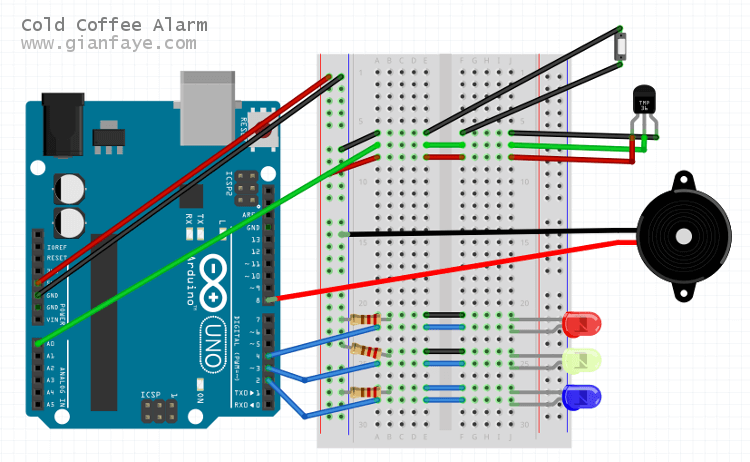
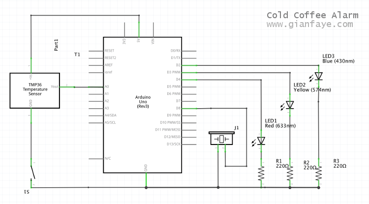

I created an alarm device that will determine the temperature of your coffee (or tea), and shows you the status if it's still HOT, WARM, or COLD with LEDs (red, yellow, and blue respectively), trigger a warning alarm if it is getting cold and will buzz continuously when it eventually gets cold.

## The Working Prototype

<div class="Image__Small">
  
</div>

## Status: HOT

When your coffee is still hot, the red LED is on and the device will stay silent.


## Status: WARM

When you are neglecting your coffee for a while and it gets warm, the yellow LED is on and the device will trigger a warning alarm to get your attention.


## Status: COLD

When you have failed to do the simple task of drinking your coffee while it's still hot, the blue LED turns on and you will hear a continuous buzz to again remind you of your failure and neglect. Time to brew another batch of hot coffee.


## The Parts

The device uses a temperature sensor [TMP36](http://www.analog.com/media/en/technical-documentation/data-sheets/TMP35_36_37.pdf) to determine your drink's temperature, a pressure plate for the device to determine if there is a cup of coffee present, a piezo buzzer for the sound alarm, and 3 LEDs to show you the status of your drink.

## The Pressure Plate

The device will only operate (check status and execute alarm) if you put your mug on it. I got the parts from [a kids science toy](https://www.instagram.com/p/1nvsARpcBG/?taken-by=gianfaye) and [a board game](https://boardgamegeek.com/boardgame/156091/sons-anarchy-men-mayhem). Partly a challenge to think about designing the plate with what I currently have at home, and make sure that it will be steady enough not to spill the drink all over my workbench. It's a makeshift switch that will close the circuit whenever some weight is added on the pressure plate. Works best for ceramic mugs.


## The Buzzer

Also got this piezo from the kids science toy I used for the pressure plate. There's a limitation from Arduino where the volume cannot be configured, hence the need to cover it up because it's too loud.


## The Sensor

Initially a challenge to ensure that the sensor touches the mug placed on the pressure plate. It needs to be flexible and not so wiggly so I braided the wires.


## The Code

I initialized 3 constants for this sketch:
```js
const int sensorPin = A0; // connects the temperature sensor to an analog pin
const int buzzerPin = 8; // connects the piezo buzzer to a digital pin
const float baselineTemp = 25.0; // the base temperature to compare with what the sensor detects
```

On the setup:
```js
Serial.begin(9600); // opens a serial port
// sets the LEDs (connected to pins 2, 3, 4) as output
for(int pinNumber = 2; pinNumber < 5; pinNumber++){
	pinMode(pinNumber, OUTPUT);
	digitalWrite(pinNumber, LOW);
}
pinMode(buzzerPin, OUTPUT); // sets the buzzer pin as an output
```

On the initial part loop:
```js
// determines the value of the sensor, this will be used to compute the voltage output
int sensorVal = analogRead(sensorPin);

// outputs the sensor value on the Serial Monitor for checking
Serial.print("Sensor Value: ");
Serial.print(sensorVal);

float voltage = (sensorVal/1024.0) * 5.0; // converts the ADC reading to voltage

// outputs the voltage reading on the Serial Monitor for checking
Serial.print(", volts: ");
Serial.print(voltage);

// converts the voltage to temperature in degrees Celcius
float temperature = (voltage - 0.5) * 100;

// outputs the temperature on the Serial Monitor for checking
Serial.print(" , degrees C: ");
Serial.print(temperature);

// will be used to print the status on the Serial Monitor
String tempStatus = "";
```

Determining the temperature:
```js
// determines if drink is COLD
if(temperature < baselineTemp) {
    // if temp is less than 25 C, turn the blue LED on
    digitalWrite(2, HIGH); // blue
    digitalWrite(3, LOW);  // yellow
    digitalWrite(4, LOW);  // red

    tempStatus = "COLD :("; // sets the status to print on later

    // turns the buzzer on
    digitalWrite(buzzerPin, HIGH);
    tone(buzzerPin, 1024, 3000); // (pin, frequency, duration)
    // the duration is the same as the delay time for the loop to mimic continuous buzzing sound
}
// determines if drink is WARM and getting cold
else if(temperature >= baselineTemp && temperature < baselineTemp + 3){
    // if temp is 25 C to 27 C, turn the yellow LED on
    digitalWrite(2, LOW);  // blue
    digitalWrite(3, HIGH); // yellow
    digitalWrite(4, LOW);  // red

    tempStatus = "Still WARM but GETTING COLD!"; // sets the status to print on later

    // turns the buzzer on
    digitalWrite(buzzerPin, HIGH);
    tone(buzzerPin, 1024, 1000); // (pin, frequency, duration)
    // the duration is less than the delay time to mimic a warning alarm sound
}
// determines if drink is still HOT
else if(temperature >= baselineTemp + 3 && temperature < baselineTemp + 8){
    // if temp is greater than 27 C but less than 35 C, turn the red LED on
    // I need to set a cap at 35 C because the temp reads very high when there's no subject to test on
    digitalWrite(2, LOW);  // blue
    digitalWrite(3, LOW);  // yellow
    digitalWrite(4, HIGH); // red

    tempStatus = "Still HOT :)"; // sets the status to print on later
}
// if there is no mug present on the pressure plate, do nothing
else{
    digitalWrite(2, LOW); // blue
    digitalWrite(3, LOW); // yellow
    digitalWrite(4, LOW); // red

    tempStatus = "Missing subject"; // sets the status to print on later
}

// prints the status of the temperature
Serial.println(" , Status: " + tempStatus);

// three-second gap for each check
delay(3000);
```

## Breadboard View

<div class="Image__Small">
  
  <figcaption>Breadboard view created using the <a href="https://fritzing.org/" target="_blank">Fritzing</a> app</figcaption>
</div>

## Schematics

<div class="Image__Small">
  
  <figcaption>Schematics created using the <a href="https://fritzing.org/" target="_blank">Fritzing</a> app</figcaption>
</div>

Total time spent for this project: `3 hours` (including the time spent figuring out the design with the available resources)

That's it! Let me know on the comments section below if you see points of improvement on this project or if you created your own. :) Enjoy your cup of hot coffee.

<hr />

#### Related post:
* [Arduino: Getting Started](/blog/arduino-getting-started/)

#### Credits:
* Illustration by [Thierry Fousse](https://dribbble.com/thierryfousse) from [Icons8](https://icons8.com/)

<hr />
