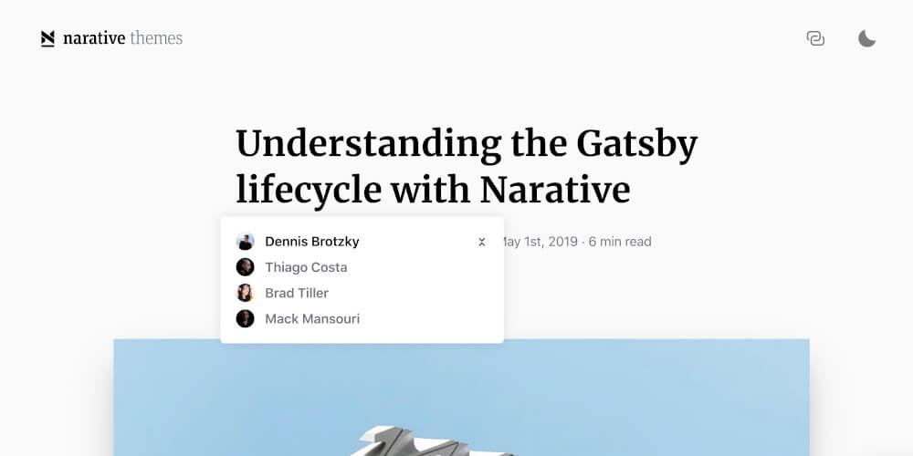

As a front-end developer, when I chanced upon the newly-coined yet-another-tech-jargon that is [JAMstack](https://jamstack.org/), I got intrigued. JAM stands for JavaScript, APIs, Markups. It is when you can build everything in JavaScript, server-side processes are abstracted into microservice APIs, and the Markup is pre-built using a static site generator. On a traditional web development project cycle, the frontend has always been stacked after UI prototyping and before backend development. But with the JAMstack, the need to manage and run web servers is entirely eliminated. Gone are the days that the frontend is mainly for the client-side and the backend for the server-side.

I started migrating my website on the last week of June this year. The previous version of my website is generated using [Jekyll](https://jekyllrb.com/), also a static site generator but based in Ruby, and deployed in Github Pages. It was first deployed in 2013 (7 years sure came by so fast). You can view it by visiting [jekyll.gianfaye.com](http://jekyll.gianfaye.com/).

## The Great Gatsby

I love [GatsbyJS](https://www.gatsbyjs.com/). I love how easy and fast it is to deploy sites that are equally lightning fast. For the first time in a long time I've coded long hours until I literally can't anymore because I needed to sleep. That is how developer-friendly it is. Their [starter library](https://www.gatsbyjs.com/starters/narative/gatsby-starter-novela) didn't fall short of templates you can scaffold with. After browsing for a bit, I already knew which template I would start with.

## The Novela Theme

Meet [Novela](https://www.gatsbyjs.com/starters/narative/gatsby-starter-novela), a Gatsby starter template made by the awesome team that is Narative. This has got to be one of the most elegant themes among the starter templates from the Gatsby library.

<div class="Image__Small">
  
</div>

It already has the basic foundation for publishing blogs with posts formatted in [Markdown](https://daringfireball.net/projects/markdown/) and queried via [GraphQL](https://graphql.org/). You can either write posts on the theme repository itself or add them via [Contentful](https://www.contentful.com/) or [Netlify](https://www.netlify.com/). Since I like writing on my IDE, I am publishing via Github Pages with the option to migrate to Contentful when I reached the [Github repo size limit](https://docs.github.com/en/github/managing-large-files/what-is-my-disk-quota). Scalability, it matters.

However, as with all starter templates, it will always be lacking all the features you wanted for your website. While the publishing tools are there, the theme is built with multiple authors in mind &mdash; similar to [Medium.com](http://medium.com/).

<div class="Image__Small">
  
</div>

I originally cloned [gatsby-starter-novela](https://github.com/narative/gatsby-starter-novela) but since I needed to customize it, I cloned the core theme and worked from there: [gatsby-theme-novela](https://github.com/narative/gatsby-theme-novela) &mdash; this is where I can modify the components and templates.

Here's the summarized structure of `gatsby-theme-novela`:
```
novela-theme
|- src
  |- components
  |- sections
    |- article
    |- articles
    |- author
  |- templates
    |- article.template.tsx // blog post
    |- articles.template.tsx // index
    |- author.template.tsx // author page
```

```
www
|- content
  |- authors
    |- avatars
    |- authors.yml
  |- posts
    |- 2017-04-27-building-hoppers-media-centre
      |- images
      |- index.mdx
```

I needed to add the following for my website:

<hr />

#### Data:
* Custom post type for my **projects**
* Custom taxonomy for blog posts: **topics**
* Custom taxonomy for blog posts: **categories**
* Custom taxonomy for project: **project types**
* Custom taxonomy for project: **clients**

#### Pages:
* Custom Home page
* Custom articles page - or the Blog listing page
* Custom article page - or the Blog post page
* Projects page
* Project page
* About page

#### Features:
* Menu links on desktop
* Toggled menu for mobile
* Sticky header
* Disqus commenting system
* Deployment to Github Pages

#### Assets:
* Custom logo and favicon
* Custom fonts
* Blog post hero images - not all my previous blog posts have images
* Project hero images

<hr />

## Adding a Custom Post Type

Since this is my portfolio site, I needed to add a new custom post type: **projects**. I replicated the structure of the original post type: **articles**

```
gatsby-theme
|- src
  |- components
  |- sections
    |- article
    |- articles
    |- author
    |- project // based from article
    |- projects // based from articles
  |- templates
    |- article.template.tsx // blog post
    |- articles.template.tsx // blog listing
    |- author.template.tsx // author page
    |- project.template.tsx // project post based from article.template.tsx
    |- projects.template.tsx // projects listing based from articles.template.tsx
```

When adding a new post type, the following files should also be modified:

1. `gatsby-config.js`
2. src > gatsby > data > `data.query.js`
3. src > gatsby > node > `createPages.js`
4. src > gatsby > node > `createResolvers.js`
5. src > gatsby > types > `index.d.ts`

<hr />

## Adding a Custom Taxonomy

Since I only have one author on my website (myself), I renamed all instances of `author` to `topic` as I may have multiple topics in one blog post. I also modified `topics.yml` (previously authors.yml) with the topics I'd want to write about.

```
gatsby-theme
|- src
  |- components
  |- sections
    |- article
    |- articles
    |- topic
    |- project // based from article
    |- projects // based from articles
  |- templates
    |- article.template.tsx // blog post
    |- articles.template.tsx // blog listing
    |- topic.template.tsx // topic page
    |- project.template.tsx // project post
    |- projects.template.tsx // projects listing
```

```
www
|- content
  |- topics
    |- avatars
    |- topics.yml
  |- posts
    |- 2017-04-27-building-hoppers-media-centre
      |- images
      |- index.mdx
```

Renaming is easy. But for the new post type **projects** where I needed to add a new taxonomy for the project type, which I named **works**, the following files should be updated as well:

1. `gatsby-config.js`
2. src > gatsby > data > `data.query.js`
3. src > gatsby > node > `createPages.js`
4. src > gatsby > types > `index.d.ts`

And on the post itself, the field (topic or work) should have a value already listed on the `topics.yml` or `works.yml`.

```
# Blog post
---
title: "Title of the Post"
slug: slug-of-the-post
topic: Topic A, Topic B
date: 2020-07-30
hero: ./images/hero.jpg
excerpt: "Excerpt of the post"
---
content of the post
```

```
# Project
---
title: "Title of the Project"
slug: slug-of-the-project
work: Project Type A, Project Type B
date: 2020-07-30
hero: ./images/hero.jpg
excerpt: "Excerpt of the project"
---
content of the project
```

<hr />

## Adding Categories

The Novela theme doesn't have categories built-in on its core theme. However, I found this [PR by saadnoor](https://github.com/narative/gatsby-theme-novela/pull/366) on the `gatsby-theme-novela` repo. It worked well and didn't find any issues when I pulled it.

```
# Blog post
---
title: "Title of the Post"
slug: slug-of-the-post
topic: Topic A, Topic B
date: 2020-07-30
hero: ./images/hero.jpg
excerpt: "Excerpt of the post"
categories: ['Category 1, Category 2']
---
content of the post
```


```
# Project
---
title: "Title of the Project"
slug: slug-of-the-project
work: Project Type A, Project Type B
date: 2020-07-30
hero: ./images/hero.jpg
excerpt: "Excerpt of the project"
categories: ['Client 1, Client 2']
---
content of the project
```

<hr />

## Sticky Header

For the sticky header, I added a custom hook to detect the user scroll activity and add / remove the `.sticky` class to the header container.

``` js
useEffect(() => {
    const header = document.getElementById("navToolbar");
    const sticky = header.offsetTop;
    const scrollCallBack = window.addEventListener("scroll", () => {
        if (window.pageYOffset > sticky) {
          header.classList.add("sticky");
        } else {
          header.classList.remove("sticky");
        }
    });
    return () => {
      window.removeEventListener("scroll", scrollCallBack);
    };
}, []);
```

``` js
const NavToolbar = styled.div`
  // some styles here

  &.sticky {
    position: fixed;
    top: 0;
    width: 100%;
  }
`;
```

## Modifying the number of shown posts

Originally, the Novela theme shows you 6 posts per page. I wanted to show 10 posts or projects on the Blog listing and Projects listing pages respectively. You can modify this on src > gatsby > node > `createPages.js`, and update the `pageLength` value.

## Deploying to Github Pages

Similar to my Jekyll site, I also wanted to deploy my website to Github via Github Pages (it's free). For this I installed [`gh-pages`](https://www.npmjs.com/package/gh-pages) and modified the `deploy` script on my `package.json`. You also need to add `--prefix-paths` to your `build` script for this to work.

``` json
"scripts": {
    "develop": "rm -rf .cache && gatsby develop",
    "clean": "gatsby clean",
    "build": "gatsby build --prefix-paths",
    "deploy": "gatsby build --prefix-paths && gh-pages -d public"
  },
```

## Conclusion

This post mostly covers the restructuring of the Novela theme to my website's structure and some of the main features I added. I also added and modified several UI and functionality such as:

* The progress bar you see on the sticky header above that progresses as you scroll down the post to give users a hint how far they are reading relative to the post length
* Added the sticky title on the right side inspired by the [Adobe Blog](https://blog.adobe.com/)
* The Instagram feed was not working for some reason and I installed and used [`gatsby-remark-instagram-embed`](https://www.gatsbyjs.com/plugins/gatsby-remark-instagram-embed/) instead
* Removed the newsletter section for now
* Added Disqus commenting system: for this I used [`gatsby-plugin-disqus`](https://www.gatsbyjs.com/plugins/gatsby-plugin-disqus/)
* The swiper thumbnail gallery on the Home page for showcasing clients: [Swiper React](https://swiperjs.com/react/)
* For the typing animation the Home page, I used [`react-typist`](https://www.npmjs.com/package/react-typist)
* Added breadcrumbs to posts

That's it! If you are currently customizing the Novela theme and needed more details on how I did some of the customizations I posted here, or if you have a post about how you customized yours, feel free to share it with the rest of us by commenting below. &darr;
