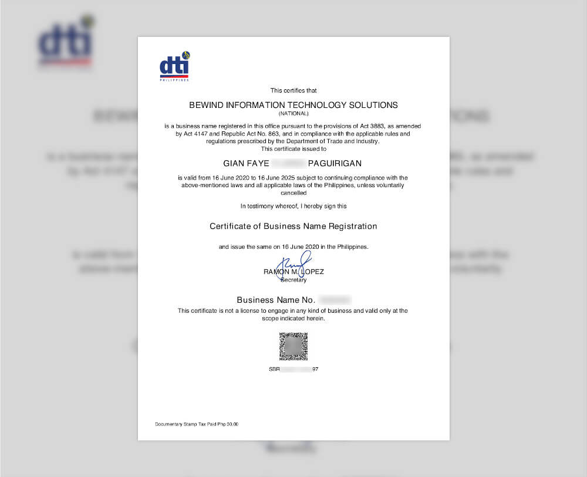
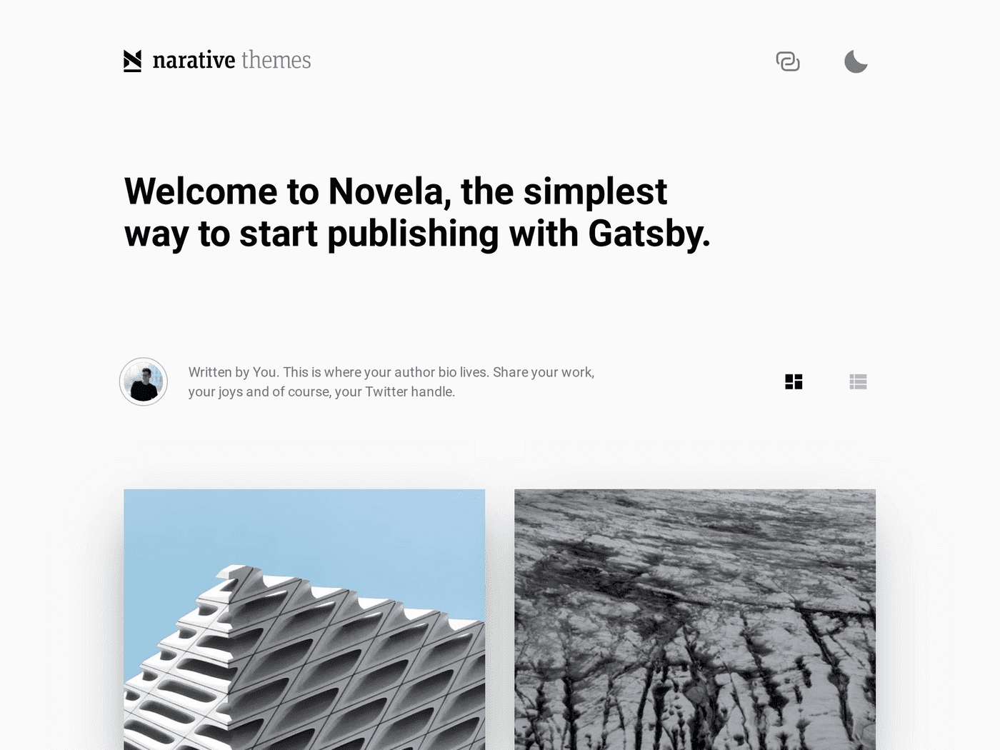

Starting a business is in almost everyone's bucket list. It always seems like part of a dream when you imagine yourself as being your own boss and managing your own schedule. It also paves way to having an additional cashflow aside from having a regular day job. But before we jump into the battle and face the intricacies of registering your business, make sure you are already buffed with these pre-combat skills:

<hr />

## Buff 1: The Entrepreneurial Mindset

Although the idea of owning a business is euphoric, our [lizard brain](https://seths.blog/2010/01/quieting-the-lizard-brain/), or that part of the brain that triggers the *fight-or-flight* response, often hinders us from making our dreams a reality. You lizard brain always tells you: "Can I really do this?" "What if I fail?" "I don't know how to start." "I'm too old for this." "It seems too complicated for me." or the oldest in the book of excuses "I have no time."

These thoughts can be [overwhelming](/blog/everyday-is-a-starting-point/) and can hold you back from achieving whatever it is you want to achieve. But as with all things you gain in life accompanies the complications you need to face. No pain, no gain, right? Owning a business isn't going to be trekking a smooth road. The first step you need to do is to have the proper mindset to prepare yourself for all the roadblocks you have to encounter. If others can do this, [why not you?](https://medium.com/@nevinbuconjic/anyone-can-start-a-business-why-not-you-743681213fe7)

<hr />

## Buff 2: The Business Idea

Now, when you are done overcoming your lizard brain and you are committed to start your business comes the next phase -- the business idea. This is an entirely vast topic to cover and we might digress with the original topic of the article. But the only question you have to answer is this: **what problems need solving?**

You do not need an entirely unique idea to start a business. There were already taxi services before Uber, there were already millions of lodging and accommodation services before Airbnb, there were already existing social media platforms before Facebook, and there were already mobile phones before Apple launched the first iPhone. What do they all have in common? They disrupt already existing services by solving problems people do not know they have.

Once you have the list of the problems, let's narrow down your options by revising the question: **what problems do you love to solve?** After answering this you've incorporated the solutions the society needs with the things you love to do, you form a connection. This connection is your business idea. As the saying goes, *do the things you love and you never have to work a day in your life*.

<hr />

## Buff 3: The Name
This is one of the most difficult buffs to achieve when starting. We often find ourselves staring blankly when we think of a name we want for our business. To help you narrow down your options, here are some considerations:

1. One word is often better than multiple words. Only use 2 or 3 words for a name if you really can't think of a one word name. Good examples of a 1-word company name are: Grab, eBay, Apple. 2 words combined to one-word company names: Facebook, Whatsapp, GoDaddy, FoodPanda.

2. The name should be easy to pronounce, spell, and remember. When people start asking you or when you start offering your services, you should be able to tell them the name without getting confusing stares. When you say it over the phone, you don't need to spell if for them. Some good examples are: Lazada, Amazon, Alibaba.

3. While thinking of name options, open [Namecheap](https://www.namecheap.com/) or any domain registrars and start typing as you think of one. It would be a big bonus if you can get a .com domain for your business as soon as you start offering your services. If it's already taken, you can also consider getting a .ph domain from [dot.PH](dot.ph) although it's more costly than a regular .com domain.

4. Think of puns related to the services you provide but don't overdo it that it fails item #1. Carousell, an online marketplace for example, is an amalgam of carousel + sell. Although you have to specify that Carousell has a double L at the end when you say it over the phone, once people get it, it is easy to remember.

<hr />

 ## Buff 4: The Business Type
 There are several types of businesses: sole proprietorship, partnership, corporation, non-profit organizations, cooperative, and so on. People joining the business owner bandwagon often start with single/sole proprietorship -- meaning you own your business and you are liable for everything related to that business. Partnership -- you co-own the business with one or more partners and the liability is spread amongst the owners. Corporation -- owned by at least 5 persons and the business is its own entity, meaning the liability is separate from its stockholders.

 This article covers the steps for registering a single proprietorship business in the Philippines.

<hr />

 Now let's jump to the most excruciating part of the business owner starter pack &mdash; **registering your business**.

## What you need to know

 For most business industries in a single proprietorship you only need to register to these two government agencies: the **Department of Trade and Industry (DTI)** and the **Bureau of Internal Revenue (BIR)**. DTI is where you will register your business name and BIR is where you will register your business so you can pay taxes.

 Other services require special registrations from governing agencies tasked to regulate the trade of certain products or services. These are businesses related to food, drugs, animals and plant exports, garment and textile exports, fish and other aquatic product exports, processing and trading of fiber products, firearms and explosives, service and maintenance of vehicles, radio and electronic communications, tourism, security agencies, and more. These special registrations won't be covered in this article.

To identify which industries are available to be registered in the Philippines, check out the [Philippine Standard Industrial Classification (PSIC)](https://psa.gov.ph/classification/psic/).

Before you can start operating your business, you need to get a **Certificate of Registration (COR)** from BIR. But before you can get a COR from BIR, you first need to have the **Certificate of Business Name Registration** from DTI.

## Business Name Registration

DTI has made it easy for aspiring business owners to register their business names online. You can head out to the [Business Name Registration System (BNRS)](https://bnrs.dti.gov.ph/) online and accomplish the business name registration without even visiting any of their physical offices. You can pay the fee via Gcash or any Bancnet partner banks. After doing this you will be able to download and print the certificate of business registration. It should look like this:

<div class="Image__Small">
  
</div>

Here's a glance of the BNRS with the fee structure depending on the scope of your business:

<div class="Image__Large">
  
</div>

You may also notice the three fields for Dominant Name, Business Name Descriptor, and Proposed Business Name.

The **Dominant Name** is the primary name of your business, this is the Buff #3 we tackled earlier in this post. It is the main identifier of your business that is unique. From the sample certificate above, that is "Bewind".

The **Business Name Descriptor** depends on the type of services you provide or the industry of your business. You can type a keyword on the search and the system will auto-suggest the descriptors. You can also do an advance search to narrow down the available descriptors based on your industry from the PSIC. From the sample certificate above, that is "Information Technology Solutions".

The **Proposed Business Name** is the concatenation of the Dominant Name and the Business Name Descriptor. This is the official business name you will use to register your business in BIR and when you provide official receipts. From the sample certificate above, that is "Bewind Information Technology Solutions".

## Bureau of Internal Revenue

If have ever been employed you must already be a taxpayer. First thing you should find out is the **Regional District Office (RDO)** where you are registered as a taxpayer. You may get this information from your employer or if you already have one, from an Income Tax Return (ITR) document. In a form to be filled out, RDO is 3-digit code. If you are unsure, you can check [the RDO list from the BIR website](https://www.bir.gov.ph/index.php/contact-us/directory/regional-district-offices.html) and search for your respective region.

For example, in **Revenue Region No. 8A MAKATI CITY** there are 2 RDOs: **Revenue District Office No. 47- East Makati City** and **Revenue District Office No. 48 - West Makati City**.

Usually, employers update your RDO when they hire you to the RDO where their business is registered. And more often, that RDO is where your employer's main office is located. If for example the office is located in East Makati, when you fill this out in the form you input `047`. But it is better to be sure which RDO you are registered than to assume because you need to know your RDO so that you know which BIR office you should go to and which lane you should fall in line to. Waiting lanes are often labeled by RDO.

Of course, you need to know your **Taxpayer's Identification Number (TIN)**. You can also find this on your ITR. You need to know both your RDO and TIN in order to proceed with the BIR registration.

Certificate of Registration


As a front-end developer, when I chanced upon the newly-coined yet-another-tech-jargon that is [JAMstack](https://jamstack.org/), I got intrigued. JAM stands for JavaScript, APIs, Markups. It is when you can build everything in JavaScript, server-side processes are abstracted into microservice APIs, and the Markup is pre-built using a static site generator. On a traditional web development project cycle, the frontend has always been stacked after UI prototyping and before backend development. But with the JAMstack, the need to manage and run web servers is entirely eliminated. Gone are the days that the frontend is mainly for the client-side and the backend for the server-side.

I started migrating my website on the last week of June this year. The previous version of my website is generated using [Jekyll](https://jekyllrb.com/), also a static site generator but based in Ruby, and deployed in Github Pages. It was first deployed in 2013 (7 years sure came by so fast). You can view it by visiting [jekyll.gianfaye.com](http://jekyll.gianfaye.com/).

## The Great Gatsby

I love [GatsbyJS](https://www.gatsbyjs.com/). I love how easy and fast it is to deploy sites that are equally lightning fast. For the first time in a long time I've coded long hours until I literally can't anymore because I needed to sleep. That is how developer-friendly it is. Their [starter library](https://www.gatsbyjs.com/starters/narative/gatsby-starter-novela) didn't fall short of templates you can scaffold with. After browsing for a bit, I already knew which template I would start with.

## The Novela Theme

Meet [Novela](https://www.gatsbyjs.com/starters/narative/gatsby-starter-novela), a Gatsby starter template made by the awesome team that is Narative. This has got to be one of the most elegant themes among the starter templates from the Gatsby library.

<div class="Image__Small">
  
</div>

It already has the basic foundation for publishing blogs with posts formatted in [Markdown](https://daringfireball.net/projects/markdown/) and queried via [GraphQL](https://graphql.org/). You can either write posts on the theme repository itself or add them via [Contentful](https://www.contentful.com/) or [Netlify](https://www.netlify.com/). Since I like writing on my IDE, I am publishing via Github Pages with the option to migrate to Contentful when I reached the [Github repo size limit](https://docs.github.com/en/github/managing-large-files/what-is-my-disk-quota). Scalability, it matters.

However, as with all starter templates, it will always be lacking all the features you wanted for your website. While the publishing tools are there, the theme is built with multiple authors in mind &mdash; similar to [Medium.com](http://medium.com/).

<div class="Image__Small">
  
</div>

I originally cloned [gatsby-starter-novela](https://github.com/narative/gatsby-starter-novela) but since I needed to customize it, I cloned the core theme and worked from there: [gatsby-theme-novela](https://github.com/narative/gatsby-theme-novela) &mdash; this is where I can modify the components and templates.

Here's the summarized structure of `gatsby-theme-novela`:
```
novela-theme
|- src
  |- components
  |- sections
    |- article
    |- articles
    |- author
  |- templates
    |- article.template.tsx // blog post
    |- articles.template.tsx // index
    |- author.template.tsx // author page
```

```
www
|- content
  |- authors
    |- avatars
    |- authors.yml
  |- posts
    |- 2017-04-27-building-hoppers-media-centre
      |- images
      |- index.mdx
```

I needed to add the following for my website:

<hr />

#### Data:
* Custom post type for my **projects**
* Custom taxonomy for blog posts: **topics**
* Custom taxonomy for blog posts: **categories**
* Custom taxonomy for project: **project types**
* Custom taxonomy for project: **clients**

#### Pages:
* Custom Home page
* Custom articles page - or the Blog listing page
* Custom article page - or the Blog post page
* Projects page
* Project page
* About page

#### Features:
* Menu links on desktop
* Toggled menu for mobile
* Sticky header
* Disqus commenting system
* Deployment to Github Pages

#### Assets:
* Custom logo and favicon
* Custom fonts
* Blog post hero images - not all my previous blog posts have images
* Project hero images

<hr />

## Adding a Custom Post Type

Since this is my portfolio site, I needed to add a new custom post type: **projects**. I replicated the structure of the original post type: **articles**

```
gatsby-theme
|- src
  |- components
  |- sections
    |- article
    |- articles
    |- author
    |- project // based from article
    |- projects // based from articles
  |- templates
    |- article.template.tsx // blog post
    |- articles.template.tsx // blog listing
    |- author.template.tsx // author page
    |- project.template.tsx // project post based from article.template.tsx
    |- projects.template.tsx // projects listing based from articles.template.tsx
```

When adding a new post type, the following files should also be modified:

1. `gatsby-config.js`
2. src > gatsby > data > `data.query.js`
3. src > gatsby > node > `createPages.js`
4. src > gatsby > node > `createResolvers.js`
5. src > gatsby > types > `index.d.ts`

<hr />

## Adding a Custom Taxonomy

Since I only have one author on my website (myself), I renamed all instances of `author` to `topic` as I may have multiple topics in one blog post. I also modified `topics.yml` (previously authors.yml) with the topics I'd want to write about.

```
gatsby-theme
|- src
  |- components
  |- sections
    |- article
    |- articles
    |- topic
    |- project // based from article
    |- projects // based from articles
  |- templates
    |- article.template.tsx // blog post
    |- articles.template.tsx // blog listing
    |- topic.template.tsx // topic page
    |- project.template.tsx // project post
    |- projects.template.tsx // projects listing
```

```
www
|- content
  |- topics
    |- avatars
    |- topics.yml
  |- posts
    |- 2017-04-27-building-hoppers-media-centre
      |- images
      |- index.mdx
```

Renaming is easy. But for the new post type **projects** where I needed to add a new taxonomy for the project type, which I named **works**, the following files should be updated as well:

1. `gatsby-config.js`
2. src > gatsby > data > `data.query.js`
3. src > gatsby > node > `createPages.js`
4. src > gatsby > types > `index.d.ts`

And on the post itself, the field (topic or work) should have a value already listed on the `topics.yml` or `works.yml`.

```
# Blog post
---
title: "Title of the Post"
slug: slug-of-the-post
topic: Topic A, Topic B
date: 2020-07-30
hero: ./images/hero.jpg
excerpt: "Excerpt of the post"
---
content of the post
```

```
# Project
---
title: "Title of the Project"
slug: slug-of-the-project
work: Project Type A, Project Type B
date: 2020-07-30
hero: ./images/hero.jpg
excerpt: "Excerpt of the project"
---
content of the project
```

<hr />

## Adding Categories

The Novela theme doesn't have categories built-in on its core theme. However, I found this [PR by saadnoor](https://github.com/narative/gatsby-theme-novela/pull/366) on the `gatsby-theme-novela` repo. It worked well and didn't find any issues when I pulled it.

```
# Blog post
---
title: "Title of the Post"
slug: slug-of-the-post
topic: Topic A, Topic B
date: 2020-07-30
hero: ./images/hero.jpg
excerpt: "Excerpt of the post"
categories: ['Category 1, Category 2']
---
content of the post
```


```
# Project
---
title: "Title of the Project"
slug: slug-of-the-project
work: Project Type A, Project Type B
date: 2020-07-30
hero: ./images/hero.jpg
excerpt: "Excerpt of the project"
categories: ['Client 1, Client 2']
---
content of the project
```

<hr />

## Sticky Header

For the sticky header, I added a custom hook to detect the user scroll activity and add / remove the `.sticky` class to the header container.

``` js
useEffect(() => {
    const header = document.getElementById("navToolbar");
    const sticky = header.offsetTop;
    const scrollCallBack = window.addEventListener("scroll", () => {
        if (window.pageYOffset > sticky) {
          header.classList.add("sticky");
        } else {
          header.classList.remove("sticky");
        }
    });
    return () => {
      window.removeEventListener("scroll", scrollCallBack);
    };
}, []);
```

``` js
const NavToolbar = styled.div`
  // some styles here

  &.sticky {
    position: fixed;
    top: 0;
    width: 100%;
  }
`;
```

## Modifying the number of shown posts

Originally, the Novela theme shows you 6 posts per page. I wanted to show 10 posts or projects on the Blog listing and Projects listing pages respectively. You can modify this on src > gatsby > node > `createPages.js`, and update the `pageLength` value.

## Deploying to Github Pages

Similar to my Jekyll site, I also wanted to deploy my website to Github via Github Pages (it's free). For this I installed [`gh-pages`](https://www.npmjs.com/package/gh-pages) and modified the `deploy` script on my `package.json`. You also need to add `--prefix-paths` to your `build` script for this to work.

``` json
"scripts": {
    "develop": "rm -rf .cache && gatsby develop",
    "clean": "gatsby clean",
    "build": "gatsby build --prefix-paths",
    "deploy": "gatsby build --prefix-paths && gh-pages -d public"
  },
```

## Conclusion

This post mostly covers the restructuring of the Novela theme to my website's structure and some of the main features I added. I also added and modified several UI and functionality such as:

* The progress bar you see on the sticky header above that progresses as you scroll down the post to give users a hint how far they are reading relative to the post length
* Added the sticky title on the right side inspired by the [Adobe Blog](https://blog.adobe.com/)
* The Instagram feed was not working for some reason and I installed and used [`gatsby-remark-instagram-embed`](https://www.gatsbyjs.com/plugins/gatsby-remark-instagram-embed/) instead
* Removed the newsletter section for now
* Added Disqus commenting system: for this I used [`gatsby-plugin-disqus`](https://www.gatsbyjs.com/plugins/gatsby-plugin-disqus/)
* The swiper thumbnail gallery on the Home page for showcasing clients: [Swiper React](https://swiperjs.com/react/)
* For the typing animation the Home page, I used [`react-typist`](https://www.npmjs.com/package/react-typist)
* Added breadcrumbs to posts

That's it! If you are currently customizing the Novela theme and needed more details on how I did some of the customizations I posted here, or if you have a post about how you customized yours, feel free to share it with the rest of us by commenting below. &darr;
