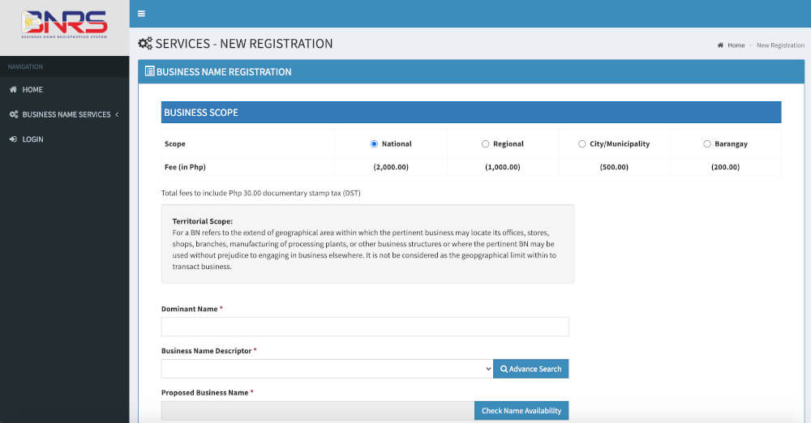
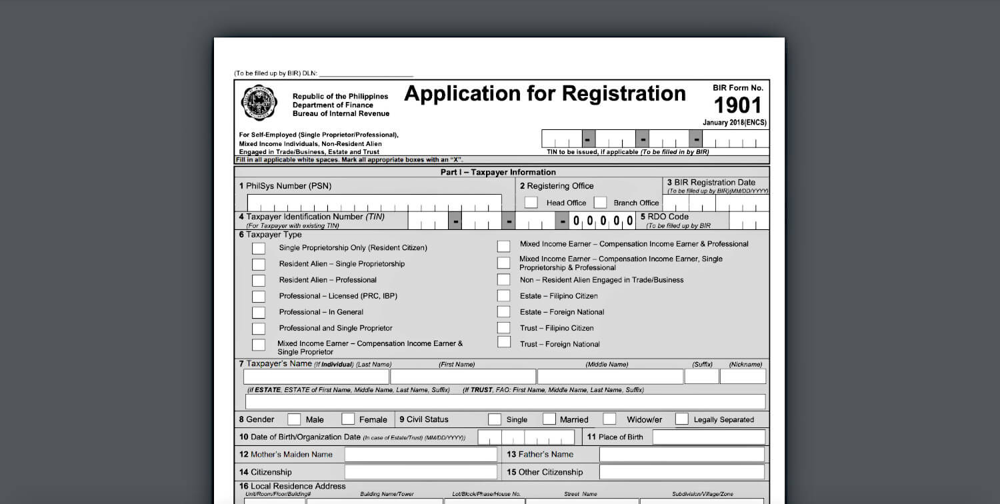

**Starting a business** is in almost everyone's bucket list. It always seems like part of a dream when you imagine yourself as being your own boss and managing your own schedule. It also paves way to having an additional cashflow aside from having a regular day job. Whether you're just entertaining the idea or already set in stone to own a business, it's helpful to know how to start and what challenges you might face from someone who already went through the entire process. This article covers the steps for starting a single proprietorship business in the Philippines.

### Table of Contents:

- [INTRODUCTION](#introduction)
  - [The Entrepreneurial Mindset](#entrepreneurial-mindset)
  - [Your Business Idea](#business-idea)
  - [The Business Name](#business-name)
  - [The Business Type](#business-type)
- [GOVERNMENT AGENCIES](#government-agencies)
  - [Department of Trade and Industry](#dti)
  - [Bureau of Internal Revenue](#bir)
- [REQUIREMENTS](#requirements)
  - [Acquiring a Certificate of Registration](#certificate-of-registration)
    - [Primary Registration](#primary-registration)
    - [Application for Authority to Print Receipts and Invoices](#application-for-atp)
    - [Registration of Book Accounts:](#book-accounts)
- [RESEARCH AND PREPARATIONS](#research-and-preparations)
    - [List of Accredited Printers of Receipts/Invoices](#accredited-printers)
    - [List of Authorized Agent Banks](#authorized-banks)
- [FORMS AND DOCUMENTS](#forms-and-documents)
  - [BIR Form 1901: Application For Registration](#bir-form-1901)
  - [Proof of Address](#proof-of-address)
  - [Valid IDS](#valid-ids)
  - [Application For Authority to Print Receipts and Invoices](#authority-to-print)
  - [Registration of Book Accounts](#book-accounts-registration)
  - [BIR Form 1905: Application for Registration Information Update/Correction/Cancellation](#bir-form-1905)
- [Additional Fees](#additional-fees)
- [BIR Form 2303: Certificate of Registration](#bir-form-2303)
- [Official Receipt](#official-receipt)
- [Due Dates of Filing](#due-dates)

  

Before we jump into the battle and face the intricacies of registering your business, make sure you are already buffed with these pre-combat skills:

## #1: The Entrepreneurial Mindset 🧠

Although the idea of owning a business is euphoric, our [lizard brain](https://seths.blog/2010/01/quieting-the-lizard-brain/), or that part of the brain that triggers the *fight-or-flight* response, often hinders us from making our dreams a reality. You lizard brain always tells you: "Can I really do this?" "What if I fail?" "I don't know how to start." "I'm too old for this." "It seems too complicated for me." or the oldest in the book of excuses "I have no time."

These thoughts can be [overwhelming](/blog/everyday-is-a-starting-point/) and can hold you back from achieving whatever it is you want to achieve. But as with all things you gain in life accompanies the complications you need to face. No pain, no gain, right? Owning a business isn't going to be trekking a smooth road. The first step you need to do is to have the proper mindset to prepare yourself for all the roadblocks you have to encounter. If others can do this, [why not you?](https://medium.com/@nevinbuconjic/anyone-can-start-a-business-why-not-you-743681213fe7)

## #2: Your Business Idea 💡

Now, when you are done overcoming your lizard brain and you are committed to start your business comes the next phase -- the business idea. This is an entirely vast topic to cover and we might digress with the original topic of the article. But the only question you have to answer is this: **what problems need solving?**

You do not need an entirely unique idea to start a business. There were already taxi services before Uber, there were already millions of lodging and accommodation services before Airbnb, there were already existing social media platforms before Facebook, and there were already mobile phones before Apple launched the first iPhone. What do they all have in common? They disrupt already existing services by solving problems people do not know they have.

You also do not need to look for larger problems, you can start small within your local community. For example, after living for more than a year in your area you find it difficult to look for a water station that delivers within the day. Or, you see the demanding rise of zero-waste stores but your community still doesn't have one. Start locally, think globally.

Once you have the list of the problems, let's narrow down your options by revising the question: **what problems do you love to solve?** After answering this you've incorporated the solutions the society needs with the things you love to do, you form a connection. This connection is your business idea. As the saying goes, *do the things you love and you never have to work a day in your life*.

## #3: The Name 🤔

This is one of the most difficult buffs to achieve when starting. We often find ourselves staring blankly when we think of a name we want for our business. To help you narrow down your options, here are some considerations:

1. One word is often better than multiple words. Only use 2 or 3 words for a name if you really can't think of a one word name. Good examples of a 1-word company name are: Grab, eBay, Apple. 2 words combined to one-word company names: Facebook, Whatsapp, GoDaddy, FoodPanda.

2. The name should be easy to pronounce, spell, and remember. When people start asking you or when you start offering your services, you should be able to tell them the name without getting confusing stares. When you say it over the phone, you don't need to spell if for them. Some good examples are: Lazada, Amazon, Alibaba.

3. While thinking of name options, open [Namecheap](https://www.namecheap.com/) or any domain registrars and start typing as you think of one. It would be a big bonus if you can get a .com domain for your business as soon as you start offering your services. If it's already taken, you can also consider getting a .ph domain from [dot.PH](dot.ph) although it's more costly than a regular .com domain.

4. Think of puns related to the services you provide but don't overdo it that it fails item #1. Carousell, an online marketplace for example, is an amalgam of carousel + sell. Although you have to specify that Carousell has a double L at the end when you say it over the phone, once people get it, it is easy to remember. I also once saw a laundry shop named The Soap Opera. Witty, right? The name sticks to whoever saw their signage.

 ## #4: The Business Type 🏭

 There are several types of businesses: sole proprietorship, partnership, corporation, non-profit organizations, cooperative, and so on. People joining the business owner bandwagon often start with single/sole proprietorship -- meaning you own your business and you are liable for everything related to that business. Partnership -- you co-own the business with one or more partners and the liability is spread amongst the owners. Corporation -- owned by at least 5 persons and the business is its own entity, meaning the liability is separate from its stockholders.

 Now let's jump to the most excruciating part of the business owner starter pack &mdash; **registering your business**.

## What you need to know

 For most business industries in a single proprietorship you only need to register to these two government agencies: the **Department of Trade and Industry (DTI)** and the **Bureau of Internal Revenue (BIR)**. DTI is where you will register your business name and BIR is where you will register your business so you can pay taxes.

 Other services require special registrations from governing agencies tasked to regulate the trade of certain products or services. These are businesses related to food, drugs, animals and plant exports, garment and textile exports, fish and other aquatic product exports, processing and trading of fiber products, firearms and explosives, service and maintenance of vehicles, radio and electronic communications, tourism, security agencies, and more. These special registrations won't be covered in this article.

To identify which industries are available to be registered in the Philippines, check out the [Philippine Standard Industrial Classification (PSIC)](https://psa.gov.ph/classification/psic/).

Before you can start operating your business, you need to get a **Certificate of Registration (COR)** from BIR. But before you can get a COR from BIR, you first need to have the **Certificate of Business Name Registration** from DTI.

## Business Name Registration in DTI

DTI has made it easy for aspiring business owners to register their business names online. You can head out to the [Business Name Registration System (BNRS)](https://bnrs.dti.gov.ph/) online and accomplish the business name registration without even visiting any of their physical offices. You can pay the fee via Gcash or any Bancnet partner banks. After doing this you will be able to download and print the certificate of business registration.

Here's a glance of the BNRS with the fee structure depending on the scope of your business:

  

You may also notice the three fields for Dominant Name, Business Name Descriptor, and Proposed Business Name.

The **Dominant Name** is the primary name of your business. It is the main identifier of your business that is unique and will most likely be your brand. For example: `Bytes`

The **Business Name Descriptor** depends on the type of services you provide or the industry of your business. You can type a keyword on the search and the system will auto-suggest the descriptors. You can also do an advance search to narrow down the available descriptors based on your industry from the PSIC. For example: `Information Technology Solutions`

The **Proposed Business Name** is the concatenation of the Dominant Name and the Business Name Descriptor. This is the official business name you will use to register your business in BIR and when you provide official receipts. From all our examples above, it will be `Bytes Information Technology Solutions`

**TAKE NOTE!** After registering your business name with DTI, you have to get a certification of registration from BIR within one month or this will incur a penalty for every month that it is still unregistered in BIR.

## Bureau of Internal Revenue

If you have ever been employed you must already be a taxpayer. First thing you should find out is the **Regional District Office (RDO)** where you are registered as a taxpayer. You may get this information from your employer or if you already have one, from your latest Income Tax Return (ITR) document. In a BIR form to be filled out, RDO is a 3-digit code. If you are unsure, you can check [the RDO list from the BIR website](https://www.bir.gov.ph/index.php/contact-us/directory/regional-district-offices.html) and search for your respective region.

For example, in **Revenue Region No. 8A MAKATI CITY** there are 2 RDOs: **Revenue District Office No. 47- East Makati City** and **Revenue District Office No. 48 - West Makati City**.

Usually, employers update your RDO when they hire you to the RDO where their business is registered. And more often, that RDO is where your employer's main office is located. If for example the office is located in East Makati, when you fill this out in the form you input `047`. But it is better to be sure which RDO you are registered than to assume because you need to know your RDO so that you know which BIR branch you should go to and which lane you should fall in line to. Waiting lanes are often labeled by RDO.

If you do not have any employment history, you should proceed to the RDO within the scope of the location of your business. For online businesses without a physical address, you should proceed to the RDO where you reside.

Lastly, you need to have a **Taxpayer's Identification Number (TIN)**. For existing employees, you can also find this on your ITR. For first time taxpayers, you need to apply for a TIN first. This will no longer be covered in this article.

You need to know both your RDO and TIN in order to proceed with the BIR registration.

## Certificate of Registration

The main objective of this article is to be equipped with the knowledge and all the requirements before heading to BIR for your business registration so that you can submit all the requirements in one day and minimize the waiting time by having all the forms needed already filled out. Depending on the industry of your business and the special registrations, you might need to fill out any additional forms. But still, by having all the primary requirements you can use your time efficiently. You don't want to wait a few hours in line and discover that you still have several forms to fill out when you are already being entertained on the designated counter.

### What you need to have

These are the requirements to register a single proprietorship business:

#### Primary Registration:

1. BIR Form 1901: Application for Registration (2 copies)
2. DTI Certificate of Business Name Registration (1 photocopy)
3. Proof of Address where your business will be located: Contract of Lease (rented) or Certificate of Land Title (owned) (1 photocopy and bring the original lease contract or original copy of land title)
4. 2 government-issued IDs - to be listed, 1 ID to be left at the guard for the visitor pass and 1 ID as a requirement (1 photocopy of the ID to be submitted as a requirement and bring the original)
5. BIR Form 0605: Payment Form (2 copies)
6. List of banks and branches accepting deposit for payment to your RDO
7. Payment of 530php: 500php Registration Fee (RF) + 30php documentary stamp

#### Application for Authority to Print Receipts and Invoices:

1. List of authorized accredited printers by your RDO
2. Sample Official Receipt (OR) from an authorized printer
3. Printer's Certificate of Accreditation and Certificate of Registration
4. BIR Form 1906: Authority to Print Receipts and Invoices (2 copies)
5. BIR Form 2000: Monthly Documentary Stamp Declaration/Return (2 copies)

#### Registration of Book Accounts:

1. 1 General Ledger (or columnar ledger if no general ledger is available)
2. 1 General Journal (or 2-column columnar if no journal is available)
3. 2 Columnar (8-14 columns)
4. BIR Form 1905: Application for Registration Information Update/Correction/Cancellation (2 copies)

You can [download the BIR forms](https://www.bir.gov.ph/index.php/bir-forms/application-forms.html) from the BIR website, print them, and fill them out before proceeding to your RDO. This will help you save time in the process. I will explain each form and the fields that are not straighforward for a non-accountant as we go along this article.

## Research and Preparations

First things first, before you go to BIR, you need to have the following researched, narrowed down, and prepared:

* [List of Accredited Printers of Receipts/Invoices](https://www.bir.gov.ph/index.php/bir-accreditations/list-of-accredited-printers-of-receipts-invoices.html): List down several accredited printers under your RDO and contact them to request for a Sample OR. Depending on the printer, the Sample OR might take 2-3 days to be developed and delivered. The rate varies by the number and type of booklets you will order. For example, 10 booklets of Official Receipt (50 x 2) white bond paper and colored carbon copy cost 2,500php. Some printers will ask for a 50% deposit when they provide a Sample OR of your business. When the printer delivers your Sample OR they should also provide photocopies of their *Certificate of Accreditation* and *Certificate of Registration*. You need to submit these two documents together with the Sample OR.

* [List of Authorized Agent Banks](https://www.bir.gov.ph/index.php/list-of-authorized-agent-banks.html): This is a list of banks and branches accepting deposit for payment. Look for the branches under your RDO. Although BIR accepts payments directly, more often their systems are down or intermittent. When this happens, you will be asked to pay via their Authorized Agent Banks. You need to have at least 5 branches nearest to your RDO prepared. The branches are specific to their respective RDOs and you cannot just go to any branch to pay. It should be the designated Authorized Agent Banks under the RDO. You also have to consider that most banks close at 3pm so you should be able to go to BIR early.

BIR branches are open Mondays to Fridays, from 8am to 5pm, except of course during non-working holidays. They have a no-lunch break policy so they operate continuously within their business hours. This no-lunch break policy does not mean their staff don't take lunch but rather they have switching arrangement when some employees will take over the counters while the others are on lunch break and vice versa. Because of the COVID outbreak, you will have to wait outside on the designated lanes before being able to allow to go inside. Waiting time depends on the day but the average waiting time outside the RDO is 1.5 hrs.

Now it's time to fill the Form 1901. &#128556;

    

## BIR Form 1901: Application for Registration

Go ahead and [download the form](https://www.bir.gov.ph/index.php/bir-forms/application-forms.html) from the BIR website. If you downloaded it from somewhere else take note that it should be the January 2018 version. You can find this on the upper right corner of the first page just below the 1901 label.

Most of the fields are pretty straighforward except the following:

### Part 1 - Taxpayer Information

Field 1. **PhilSys number** - If at the time of reading the National ID has not yet been distributed, you may leave this blank.

Field  2. **Registering Office** - Select **Head Office** as you are registering the business for the first time.

Field  6. **Taxpayer Type** - If you are not employed, select **Single Proprietorship Only**. If you are currently employed, select **Mixed Income Earner - Compensation Income Earner & Single Proprietor**.

Field 23. **Are you availing of the 8% income tax rate option in lieu of Graduated Rates?** Yes or No - explained below

**VAT vs NON-VAT**

If the projected annual income is below 3 million Pesos, you are not required to register for VAT. If you are NON-VAT, the answer to the question "Are you availing of the 8% income tax rate option in lieu of Graduated Rates?" should be Yes. If VAT, the answer should be No.

More reading: [8 Benefits of 8% Gross Income Tax Rate](https://mpm.ph/8-percent-tax-rate-benefits)

### Part 3 - Authorized Representative

If you opt to have a representative to submit your requirements you need to have a notarized Special Power of Attorney (SPA) as well as valid IDs of you (the owner) and the authorized representative. If you will submit the requirements personally, you may disregard this section.

### Part 4 - Business Information

Field 35. **Primary/Secondary Industries** - under Primary Trade/Business Name add the name of the business you registered under DTI. Under Regulatory Body on the same row, write DTI.

### Part 5 - Authority to Print

You can fill out these fields after you receive the Sample OR together with the Printer's Certificate of Accreditation and Certificate of Registration from your printer.

Lastly, sign the Declaration section with your signature over printed name.

## Proof of Address

If the business location is rented, you will need to submit a photocopy of the **Contract of Lease**. If the business location is owned you need the **Certificate of Land Title**.

**TAKE NOTE!** The notarized date of the contract of lease should be within the month when you'll be registering your business. If the business is online, and you are renting where you reside, you have to renew your Contract of Lease. In my case I submitted a Contract of Lease that was notarized for more than a year, and I had to pay 1,500php worth of accumulated penalties for every month since the notarized date up to the date when I submitted my application for registration.

## Valid IDs

Any government-issued IDs are acceptable &mdash; Birth Certificate, passport, driver's license, community tax certificate, UMID, TIN ID; and that shows your name, address, and birthdate. In case the address is not visible on the ID, any proof of residence or business address will do as a supporting document in addition to the ID.

## Application for Authority to Print Receipts and Invoices

After filling out two copies of the **BIR Form 0605: Payment Form**, and having the required documents from your printer: the **Sample Official Receipt**, the printer’s **Certificate of Accreditation** and **Certificate of Registration**, you can then proceed to fill out two copies of **BIR Form 1906: Authority to Print Receipts and Invoices**, and two copies of **BIR Form 2000: Monthly Documentary Stamp Declaration/Return**.

## Registration of Book Accounts

You can now proceed to purchasing the required books for the registration of your book accounts. As mentioned from the list of requirements above, these are the following:

1. One (1) General Ledger (or columnar ledger if no general ledger is available)
2. One (1) General Journal (or 2-column columnar if no journal is available)
3. Two (2) Columnar (8-14 columns)

You can purchase these from bookstores and just ask them to look them for you as they are mixed together with other books and might be confusing to non-accountants (like me). &#128584;

## BIR Form 1905: Application for Registration Information Update/Correction/Cancellation

After acquiring these books, you can then proceed to filling out two copies of **BIR Form 1905: Application for Registration Information Update/Correction/Cancellation** and fill out the Books of Accounts section **(1) Taxpayer Information** on the first page and section **(10) Books of Accounts** on the third page and sign the Declaration section.

## Additional Fees

Lastly, as an added preparation, bring at least 2,000php in addition to the 530php registration fee as taxpayer profiles vary, and we wouldn't know if you might encounter a different penalty for whatever unforeseen reason.

## BIR Form 2303: Certificate of Registration

After submitting your requirements, you have to wait 5-7 business days before your **BIR Form 2303: Certificate of Registration** can be picked up. The duration might vary depending on the Regional District Office so it's helpful to ask them for the date.

## Official Receipt

Once you've already received your **Certification of Registration**, they will also provide the **Authority to Print** that you will then hand over to your printer, so they could proceed printing your official receipts.

## Due Dates

Be aware of the filing due dates from your COR. Regardless if you have income for the month or none, you have to file these declarations. The penalty for a month undeclared ranges from 1,000php to 1,500php. You can file in person to your RDO or via [BIR's eFiling and Payment System](https://efps.bir.gov.ph/) online.

That's it! If you encounter anything on your business registration that might be helpful to others reading this article feel free to share them on the comments section below. &darr;

#### Credits:
* Illustration by [Natasha Remarchuk](https://icons8.com/illustrations/author/5e7e24ce01d0360013bb7479) from [Icons8](https://icons8.com/)

