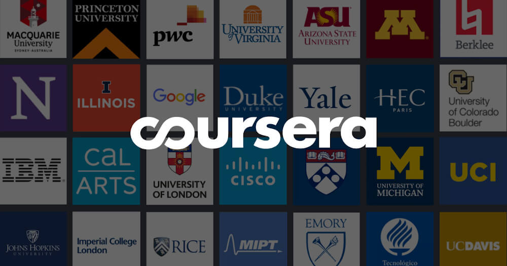
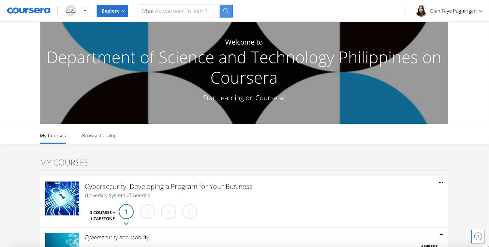

The **Department of Science and Technology (DOST)** offers Coursera grants to everyone to help Filipinos keep learning during this time of pandemic when everyone is advised to stay at home.

**Coursera** is a massive open online course (MOOC) platform that offers courses and specializations from renowned universities and educational institutions around the world. As of 2020, they offer access to 3000+ courses in the fields of Arts and Humanities, Business, Computer Science, Data Science, Information Technology, Health, Math and Logic, Personal Development, Physical Science and Engineering, Social Sciences, and Language Learning.

    
    <figcaption>Coursera Partner Universities and Institutions</figcaption>

These grants will provide a certificate of completion for free after completing a course. Coursera originally offers a free audit of their courses but in order to receive a certificate you have to pay their monthly subscription fee ranging 39USD to 79USD (roughly 2,000php to 4,000php).

The registration deadline is on **October 31, 2020** while the deadline for the completion of courses to be able to receive a certificate for free is until **December 31, 2020**. You can still continue to complete the course after December 31 but you will have to start a paid subscription to receive a certificate.  That's 2 months worth of savings and time well invested on learning!

To apply for the grant, fill out this form: [http://bit.ly/ApplyDOSTCoursera](http://bit.ly/ApplyDOSTCoursera).

    
    <figcaption>Coursera DOST Dashboard</figcaption>

To register on Coursera, go to [www.coursera.org](https://www.coursera.org/).

For more updates about the Coursera DOST grant, [follow DOST Caraga on Facebook](https://www.facebook.com/DOST.Caraga/).

Feel free to share this to anyone you know!
