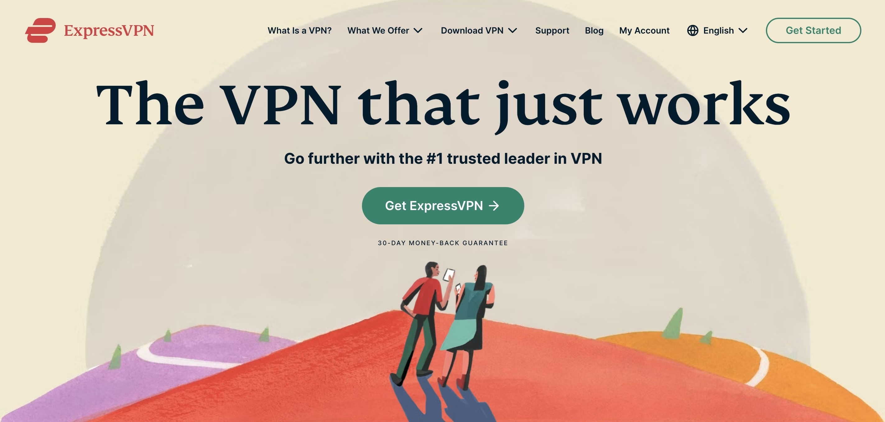
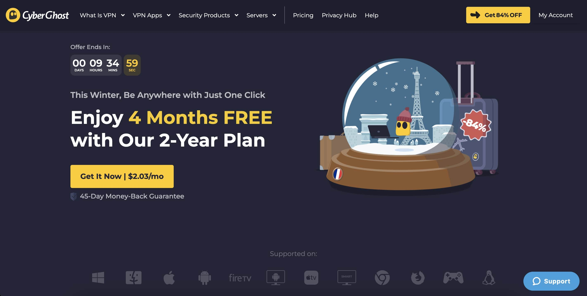
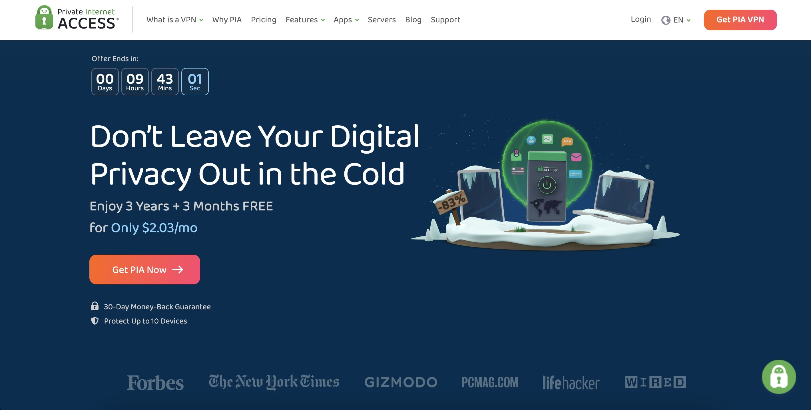
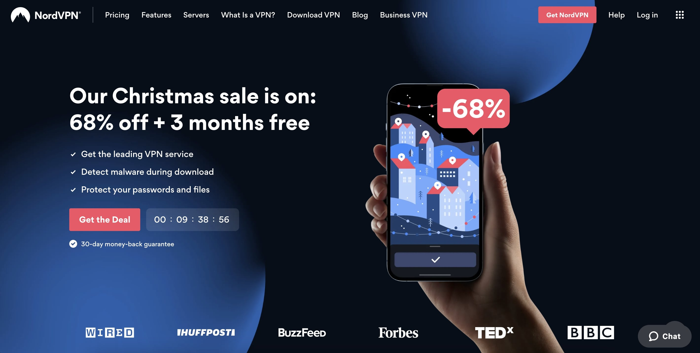
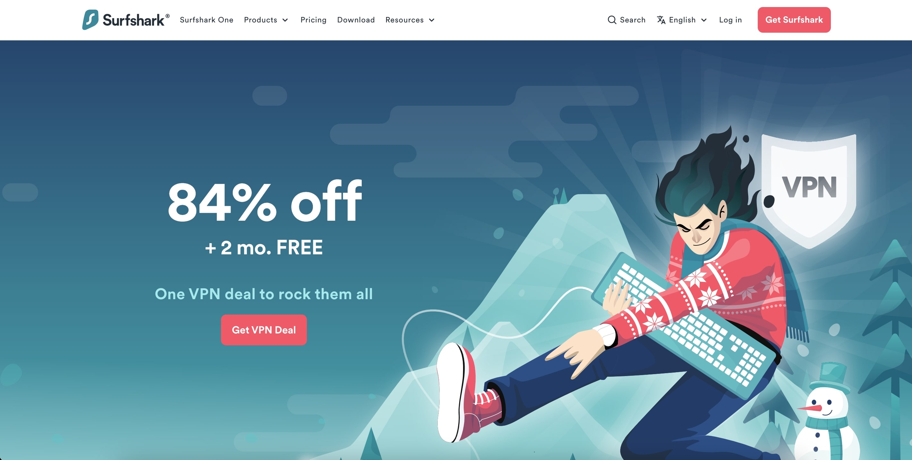

**Virtual private networks (VPNs)** are becoming an increasingly popular tool for ensuring online privacy and security. You can use a VPN to connect to the internet via a secure, encrypted connection, which can help to protect your data and keep your online activities private.

There are several reasons why you should set up a virtual private network (VPN):

* **Security**: Creates a secure, encrypted connection to the internet to protect your online data and activities. This is especially useful if you use public Wi-Fi or are concerned about online threats like hackers or malware.

* **Privacy**: Hides your IP address and location to protect your online privacy. If you don't want your online activities tracked or if you're concerned about your online data being collected and sold to third parties, this can be useful.

* **Access to blocked content**: Certain websites or services may be blocked in your area due to censorship or other factors. By routing your internet connection through a server in a different location, a VPN can assist you in accessing these blocked websites.

* **Improved online performance**: By lowering latency and increasing speeds, using a VPN can improve your online performance. This is especially useful if you play video games or frequently stream video or download large files.

In this article, we'll take a look at the **top five (5) VPN products available in the Philippines**.

## 1. ExpressVPN

**ExpressVPN** is a well-known and highly respected virtual private network (VPN) provider that has been around for over a decade. One of the things that sets ExpressVPN apart is its fast speeds, which make it a great option for streaming and downloading. Because the company has a large network of servers located all over the world, you'll have many options for connecting to the internet.

* **Security**: ExpressVPN employs AES-256 encryption, which is regarded as among the strongest available. In addition, the company has a no-logs policy, which means it does not track your online activities. Furthermore, ExpressVPN supports a number of protocols, including OpenVPN, L2TP/IPSec, and PPTP.

* **Multi-platform**: ExpressVPN supports for a wide range of devices and platforms. In addition to traditional desktop and mobile devices, the company also offers apps for smart TVs, gaming consoles, and routers. This means you can use ExpressVPN to protect all of your devices, not just your computer or smartphone.

* **Pricing**: ExpressVPN is compatible with a wide range of devices and platforms. The company provides apps for smart TVs, gaming consoles, and routers in addition to traditional desktop and mobile devices. This means that ExpressVPN can be used to protect all of your devices, not just your computer or smartphone.

**Verdict**: With a wide range of supported devices and platforms, <a href='https://bit.ly/ExpressVPNPH' target='_blank' rel='nofollow'>ExpressVPN</a> is a solid choice for anyone looking for a fast and reliable VPN provider on the go.

## 2. CyberGhost

**CyberGhost** is a well-known virtual private network (VPN) service provider that provides a variety of features at a reasonable price. Since the organization has a huge network of servers located all over the world, you'll have many options for connecting to the internet.

* **Streaming and Torrenting**: One of CyberGhost's notable features is its capability for streaming and torrenting. If you enjoy watching movies or TV episodes online or downloading torrents, CyberGhost can help you do so securely and privately. The organization secures your connection with AES-256 encryption and has a no-logs policy, which means it does not track your online actions.

* **Security Features**: In addition to streaming and torrenting support, CyberGhost provides a number of security and privacy features. Support for numerous protocols, including OpenVPN, IKEv2, and WireGuard, is included, as is an ad blocker to help protect you from online tracking and intrusive adverts.

* **Performance**: In terms of performance, CyberGhost is generally considered to be fast and reliable. The company has a large network of servers located around the world, which means you'll have multiple options for connecting to the internet.

* **Pricing**: CyberGhost offers a range of options to fit different budgets. The company offers a monthly plan as well as annual and biannual plans with substantial discounts. CyberGhost also offers a 45-day money-back guarantee, which is longer than many other VPNs.

**Verdict**: <a href='https://bit.ly/CyberGhostVPNPH' target='_blank' rel='nofollow'>CyberGhost</a> is a great option for budget-conscious users who want to get the best bang for their buck.

## 3. Private Internet Access (PIA)

**Private Internet Access (PIA)** is a reputable virtual private network (VPN) service provider that has been in business for over a decade. The organization is well-known for its robust security features, which include a no-logs policy and support for multiple protocols.

* **Security Features**: One of the primary advantages of utilizing a VPN like PIA is the increased protection and privacy it provides while online. You can use a VPN to connect to the internet over a secure, encrypted connection, which can assist to protect your data and keep your online activities private. To secure your connection, PIA employs AES-256 encryption, which is regarded as one of the strongest available.

* **Performance**: PIA is well-known for its fast speeds and reliable performance, as addition to its excellent security features. This makes it an excellent choice for streaming, downloading, and general use. Because the organization has a wide network of servers placed all over the world, you'll have several options for connecting to the internet.

* **Pricing**: PIA offers a wide range of options to accommodate a variety of budgets. The company offers a monthly plan as well as annual and biannual plans with substantial discounts. PIA also provides a seven-day money-back guarantee, allowing you to test the service and get a full refund if you are not satisfied.

**Verdict**: <a href='https://bit.ly/PrivateInternetAccessVPNPH' target='_blank' rel='nofollow'>Private Internet Access</a> is a trusted choice for anyone looking for a reliable and secure VPN provider with performance in mind.

## 4. NordVPN

**NordVPN** is another popular VPN provider that has gained a lot of traction in recent years. Like ExpressVPN, it has a large network of servers located around the world, which means you'll have plenty of options for connecting to the internet.

* **Security Features**: Numerous protocols are supported by NordVPN, including OpenVPN, IKEv2, and WireGuard. This implies that you can select the protocol based on your preferences, be they for security, speed, or compatibility with a certain hardware or software platform. Additionally, NordVPN adheres to a no-logs policy, which means that it doesn't monitor your internet activities.

* **Streaming and Torrenting**: In addition to its strong security features, NordVPN also offers support for streaming and torrenting. If you're a fan of streaming movies or TV shows, or if you frequently download torrents, NordVPN can help you to do so securely and privately.

* **Performance**: NordVPN is generally considered to be fast and reliable. The company has a large network of servers located around the world, which means you'll have plenty of options for connecting to the internet.

* **Pricing**: One potential disadvantage of NordVPN is that it does not provide a free trial, as some other VPNs do. However, the company does have a 30-day money-back guarantee, allowing you to try out the service and receive a full refund if you are not satisfied.

**Verdict**: <a href='https://bit.ly/NordVPNPH' target='_blank' rel='nofollow'>NordVPN</a> is a popular choice for anyone looking for a VPN provider with support for streaming and torrenting, strong security and privacy features, and flexible pricing options.

## 5. Surfshark

**Surfshark** is a relatively new VPN service that has grown in popularity in recent years. It provides a wide range of functions at a low cost, making it an excellent choice for budget-conscious customers.

* **Performance**: Surfshark is generally considered to be fast and reliable. The company uses AES-256 encryption and has a no-logs policy. It also supports a variety of protocols, including OpenVPN, IKEv2, and WireGuard.

* **Multi-Connectivity**: Surfshark boasts an unlimited simultaneous connections policy, which allows you to connect as many devices as you want to the VPN at the same time. This is particularly useful if you have a large household or want to use the VPN on multiple devices.

* **Streaming and Torrenting**: Surfshark also supports torrenting and streaming. If you enjoy watching movies or TV shows online, or if you routinely download torrents, Surfshark can assist you in doing so securely and privately.

* **Pricing**: Surfshark has three subscription plans: monthly, six-month, and annual. The annual plan turns out to be the least expensive alternative. Surfshark also has a 30-day money-back guarantee, allowing you to try the service and receive a full refund if you are not satisfied.

**Verdict**: <a href='https://bit.ly/SurfSharkVPNPH' target='_blank' rel='nofollow'>Surfshark</a> is the go-to VPN for anyone who will benefit from its unlimited simultaneous connections policy, as well as its support for streaming and torrenting, making it a good fit for a large household.

Ultimately, the best VPN for you will depend on your specific needs and preferences. It is a useful tool for anyone who wants to protect their online security, privacy, and access to content. However, keep in mind that no VPN can guarantee complete anonymity or security, and it's always a good idea to use caution and common sense when using the internet. 😉

Do you know any other reliable VPNs? Let us know on the comments section below. 👇🏻
