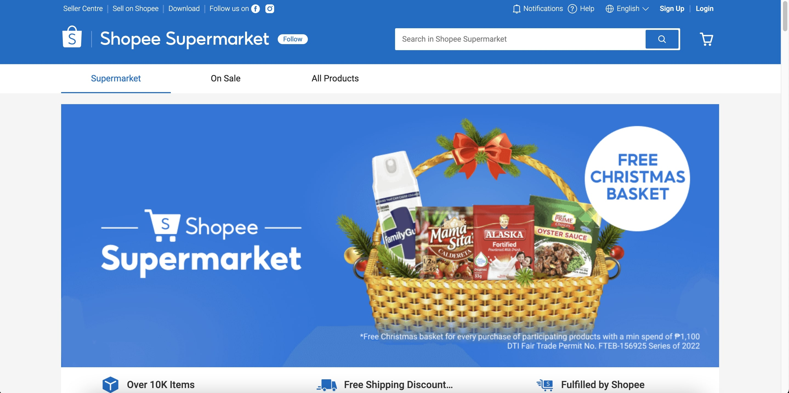

**Online grocery shopping** has become increasingly popular in the Philippines in recent years, with a number of apps and websites offering a wide range of grocery items for home delivery or pickup. These online platforms offer a convenient way for users to shop for groceries from the comfort of their own home. 💆🏼‍♀️‍💁🏼‍♀️

## Pros of Online Grocery Shopping

* **Convenience**: One of the main benefits of online grocery shopping is the convenience it offers. Users can shop from a variety of stores and brands without having to physically visit a store, and they can often schedule delivery or pickup at a time that is convenient for them.

* **Time-saving**: Online grocery shopping can save users' time, as they can shop from the comfort of their own home and don't have to spend time traveling to and from a physical store.

* **Money-saving**: Online grocery shopping can also save users money, as they can easily compare prices and discounts from different stores and brands. Many online grocery platforms also offer loyalty programs or other rewards for regular users.

* **Wide selection**: Online grocery platforms offer a wide range of products, including fresh produce, meat, dairy products, and household essentials. This means users have a wide variety of options to choose from.

* **Accessibility**: Online grocery shopping can be particularly useful for those who are unable to go to a physical store due to reasons such as disability, illness, or the COVID-19 pandemic.

## Cons of Online Grocery Shopping

While online grocery shopping has many benefits, such as convenience and the ability to compare prices and discounts from different stores and brands, there are also some potential drawbacks to consider. These include:

* **Quality of products**: One concern with online grocery shopping is the quality of the products, as users may not be able to physically inspect the items before they are delivered. There is a risk that items could be damaged during delivery or that they may not be as fresh as they would be if purchased in-store.

* **Delivery fees**: Many online grocery platforms charge a delivery fee for home delivery, which can add to the overall cost of the purchase. In some cases, the delivery fee may be waived if the order is above a certain amount.

* **Limited selection**: While online grocery platforms offer a wide range of products, they may not have the same selection as a physical store. This can be a problem if users are looking for a specific item that is not available online.

* **Product substitutions**: In some cases, online grocery platforms may substitute an item in an order if the requested item is out of stock. This can be a problem if users are looking for a specific brand or type of product.

* **Technical issues**: There is always a risk of technical issues with any online platform, such as website or app crashes or payment issues. These issues can be frustrating for users and may result in delays or inconvenience.

Here are the top online grocery apps and websites in the Philippines:

## LazMart

**Lazada** is a popular e-commerce platform that offers a wide range of products, including groceries with its new <a href='https://bit.ly/LazmartPH' target='_blank' rel='nofollow'>LazMart</a> store. The site offers home delivery or pickup options, and it has a loyalty program called LazWallet, which allows users to earn points and redeem them for discounts on future purchases.

## Shopee Supermarket

**Shopee** is another popular e-commerce platform that offers a wide range of products, including groceries. The site offers home delivery or pickup options on its <a href='https://shopee.ph/supermarket' target='_blank' rel='nofollow'>Shopee Supermarket</a> store, and it has a loyalty program called Shopee Coins, which allows users to earn coins and redeem them for discounts on future purchases. Currently, users are limited to maximum of 20 items to proceed the order. This can be quite disappointing for shoppers who do bulk orders on a recurring basis.

## GrabMart

**GrabMart** is an online grocery platform that is part of the Grab app, which is known for its ride-hailing and food delivery services. Users can shop for groceries on <a href='https://www.grab.com/ph/mart' target='_blank' rel='nofollow'>GrabMart</a> and either have them delivered to their home or pick them up at a designated location.

## MetroMart

**MetroMart** is a reliable and convenient option for those looking to do their grocery shopping online and has already operated for several years marking it as the first online grocery platform in the Philippines. <a href='https://bit.ly/MetroMartGroceryPH' target='_blank' rel='nofollow'>MetroMart</a> offers a wide range of products, including fresh produce, meat, and dairy products, and has unique features that are not available with the other platforms such as: bulk orders (I was able to purchase 40+ items), order from multiple stores in 1 checkout, free delivery and shopping fee vouchers, and more. With its wide selection, competitive prices, and excellent customer service, it is no wonder that MetroMart has become a popular choice for many shoppers.

## Rappit

**Rappit** (formerly PureGo) is a newly-revamped online grocery delivery service in collaboration with Puregold Group and Globe's 917Ventures. <a href='https://rappit.ph' target='_blank' rel='nofollow'>Rappit</a>  allows customers to shop for their groceries from the comfort of their own home. However, I'm not a fan of the small font sizes on the website. It makes it a bit difficult especially for the visually-challenged individuals to use it.

## Pick.A.Roo

**Pick.A.Roo** is another new player in the online grocery shopping market in the Philippines. <a href='https://pickaroo.com' target='_blank' rel='nofollow'>Pick.A.Roo</a> is founded by a prominent figure in the retail and real estate industry with interests in food and beverages and hospitality. Its unique color palette makes it stand out amongst its competitors.

## MyKuya

**MyKuya** is a mobile app that allows users to hire local helpers to do tasks such as grocery shopping and delivery. Users can shop for groceries on the app and either have them delivered to their home or pick them up at a designated location. <a href='https://www.mykuya.com' target='_blank' rel='nofollow'>MyKuya</a> currently does not have a web app version but it is helpful if you want a more personalized approach to your online grocery shopping experience.

Overall, these online grocery apps and websites offer a convenient way for users in the Philippines to shop for groceries from the comfort of their own home. It can be a particularly useful option for those who are short on time or who have difficulty accessing physical stores.

How about you? Have you used any of these online grocery shopping apps? 🛒   Feel free to share your experience on the comments section below. 👇🏻

