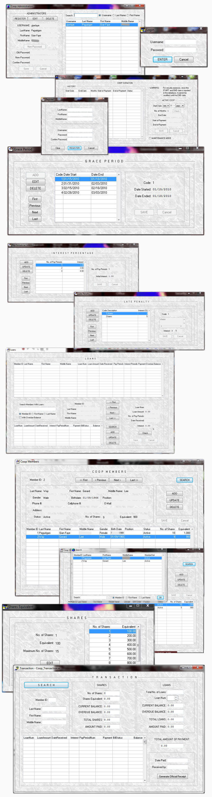
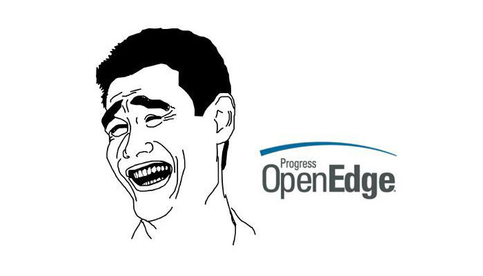

While I was taking up my internship at [InfoMan](http://infomaninc.com/), I created a cooperative loan system for them. I developed the software using a proprietary business language they use for their clients - [Progress Open Edge Advanced Business Language](http://en.wikipedia.org/wiki/OpenEdge/_Advanced/_Business/_Language).

I self-studied the language first but had a difficult time gathering resources and tutorials as the language is proprietary.

I swear it is one of the most [horrifying](https://abevoelker.com/cure_for_the_plague_openedge_migration/) [languages](http://www.oehive.org/node/1913) ever built in the history of the information age. Learning it makes you want to pull your hair out and realizing it's not worth it.

