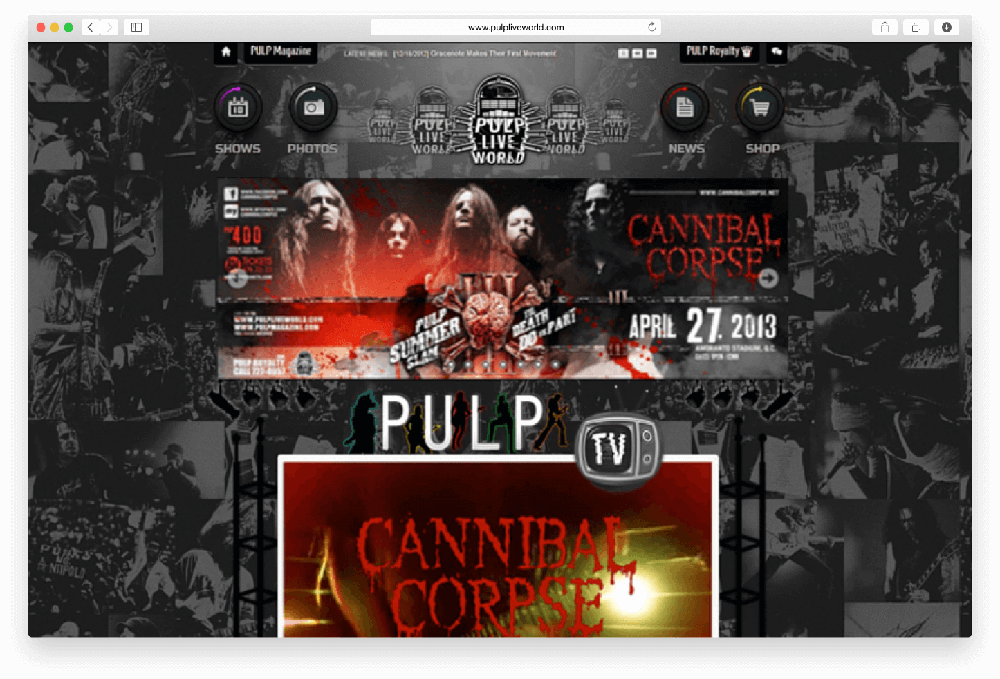
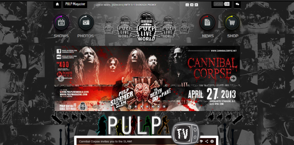
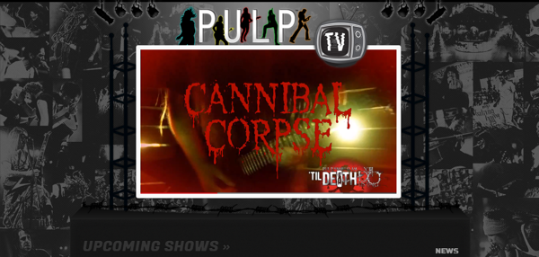
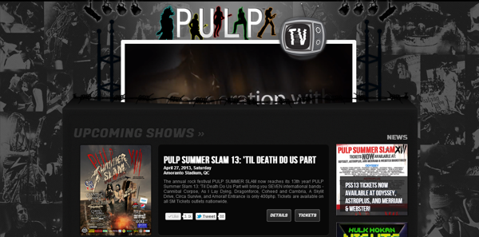
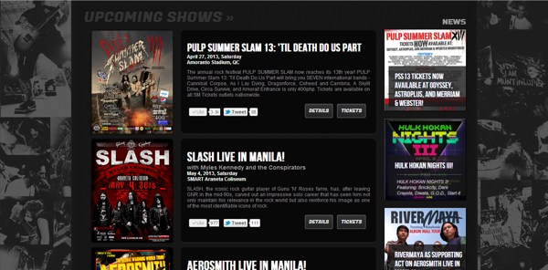
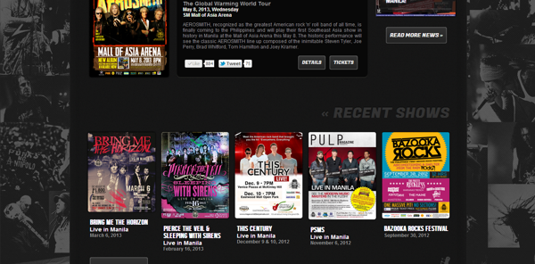
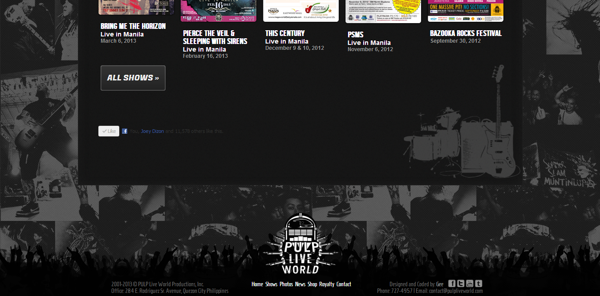

  

**PULP Live World** produces concerts and festivals featuring international and local artists. [PULP Live World Production, Inc.](/project/pulp-live-world) is a subsidiary of [PULP Magazine](/project/pulp-magazine), the premier music publication in the Philippines. They are known for **PULP Summer Slam**, the largest annual metal music festival in Southeast Asia.

## The Site

The website serves as the information and promotional site to their upcoming events and as an archive of their shows since the past decade. The design is skeuomorphic and shows elements relevant to the music event production industry. Built with the website is an e-commerce for their merchandise.

  
  <figcaption>The banner slider   as a billboard.</figcaption>

  
  <figcaption>The video player as a stage, shows trailers of their   upcoming and past shows.</figcaption>

  
  <figcaption>Yes, the stage goes underground   as you scroll down.</figcaption>

  
  <figcaption>This shows all their   upcoming events.</figcaption>

  
  <figcaption>This shows all their   past events.</figcaption>

  
  <figcaption>Footer has silhouette of an audience.</figcaption>

The site is built with Joomla and the online shop is created with the Virtuemart component.

Most parts of the website are developed with custom modules.

#### Credits:
* Web design, frontend development, and deployment by me

