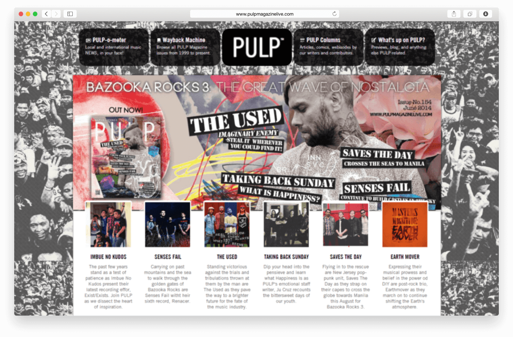
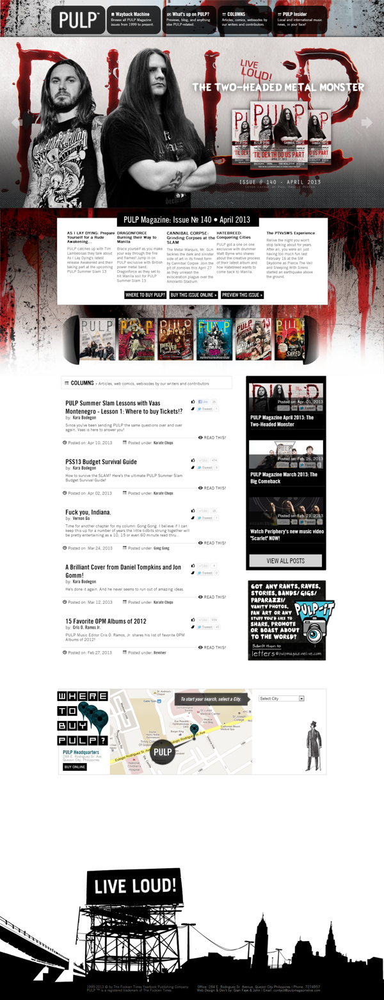
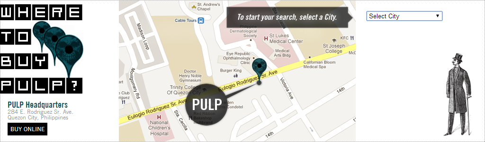

  

**PULP Magazine** is the premier music publication in the Philippines since 1999, owned by The Fookien Times Yearbook Publishing Co.

## The Site

The website serves as a preview portal of the latest published issue and as a wayback machine, which provides information of their back issues. We built a custom CMS and features different sections (e.g. News, Blog, Column, Reviews) to publish different types of content which is all managed through an admin panel we also developed in PHP/MySQL.

We also spiced it with a helpful locator widget called "Where to buy PULP?" where visitors can search which stores they can get a grab on the latest issue of PULP Magazine.

#### Credits:
* Custom CMS co-developed with John Louie Vera
* Supported by interns Jeniffer Arroyo and Carlo Villoria
* Web design, frontend development and deployment by me

