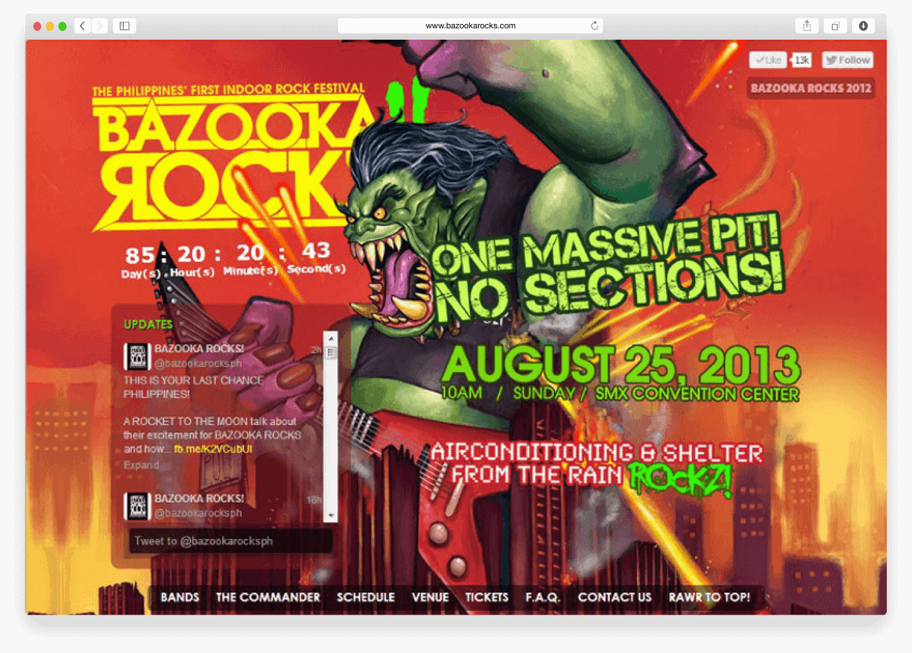
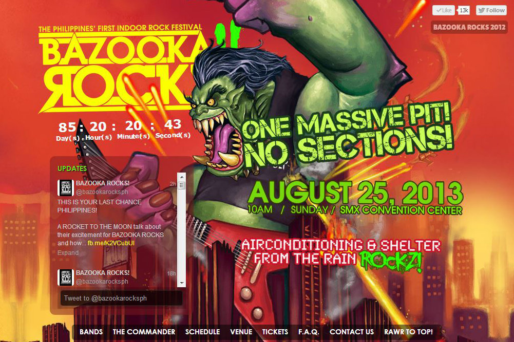

  

**BAZOOKA ROCKS Festival** is the Philippines' first indoor rock festival that provides concertgoers the ultimate concert experience within a controlled, safe and perhaps most importantly an air-conditioned environment &mdash; brought to you by PULP Live World Production.

## The Site
The microsite is the official event web page for [the 2nd year](http://pulpliveworld.com/shows/2013/bazooka-rocks) of Bazooka Rocks Festival by PULP Live World Production.

## Client

[PULP Live World Production, Inc.](/project/pulp-live-world) is a subsidiary of [PULP Magazine](/project/pulp-magazine-live), the premier music publication in the Philippines.

PULP Live World produces concerts and festivals featuring international and local artists.

#### Credits:
* Illustrations featured on the website are created by Raymond Marzan
* Co-developed with Derick Vincent Balog
* Frontend development and deployment by me

