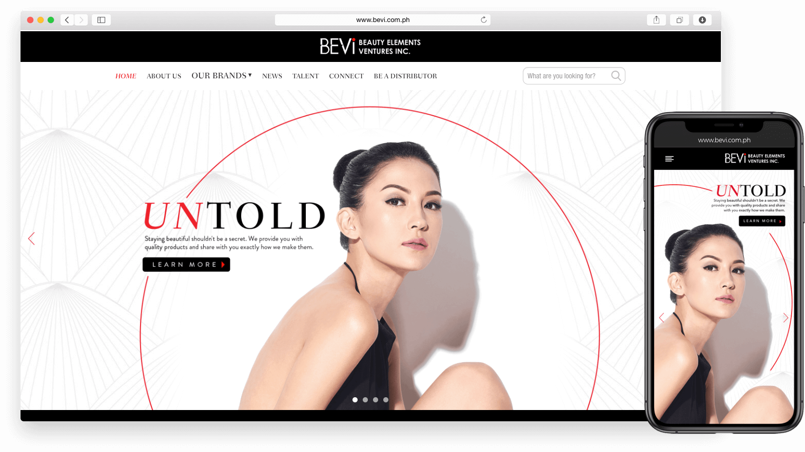
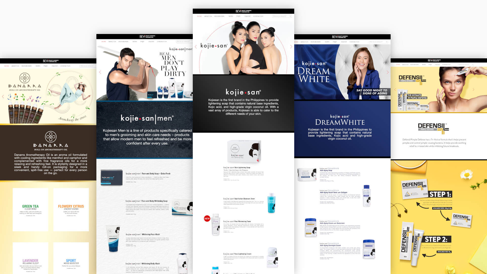

  

**Beauty Elements Ventures Inc (BEVi)** is a Philippine-based beauty and skin care company known for their Kojie-san brand product line.

## The Site
The website serves as the official website of BEVi and showcases all of their brands: Kojie-san, Kojie-san DreamWhite, Kojie-san Men, Kojie-san Sunblock, Bellic, Defensil, Pureganics, Danarra, and Scent Therapy.

  

You can visit the website at [www.bevi.com.ph](https://www.bevi.com.ph/).

#### Credits:
* Web design by an outsourced agency
* Frontend development by me
* Project of [Propelrr](https://propelrr.com/)

### If you are interested to start a project similar to this,   contact [info@propelrr.com](mailto:info@propelrr.com).

 
