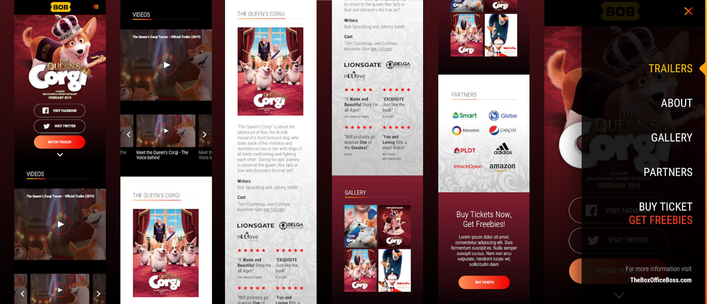

  

**The Queen's Corgi** is a film about the adventure of Rex, the British monarch's most beloved dog, in his epic journey to fall in love and discover his true self. The Queen's Corgi is distrubuted by Go Asia Entertainment to Philippine cinemas on May 2019.

The landing page is launched for The Queen's Corgi movie premiere. It is a one-page layout with anchor links to sections and features video trailers, movie summary, poster gallery, and a countdown to the premiere date that turns into a Buy Tickets button on the showing date in cinemas.

  
  <figcaption>The Queen's Corgi landing page on mobile</figcaption>

You can visit the page at **www. goasiaentertainment.com/the-queens-corgi**.

#### Credits:
* Web design not mine
* Frontend development by me
* Project of one of the top digital marketing agencies in the Philippines

### All information and materials posted here are available to the public and are copyrighted by their respective owners. There is no intended claim of ownership to any of the materials posted in this page and is for the sole purpose of showcasing the skills and previous works of the developer as part of their portfolio.

 
