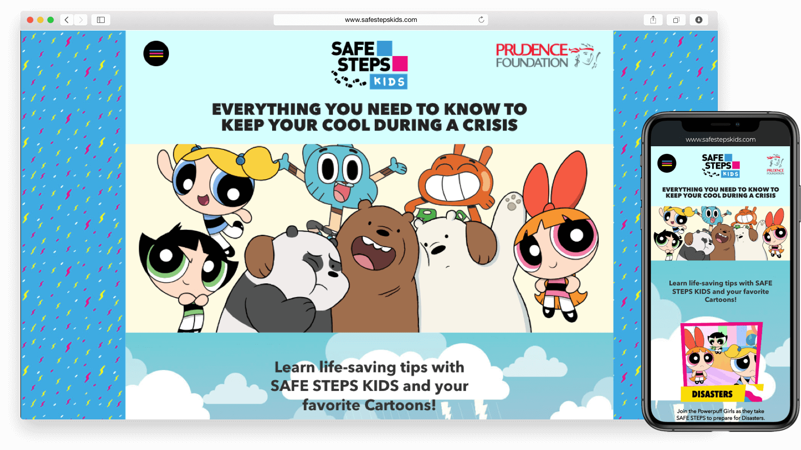
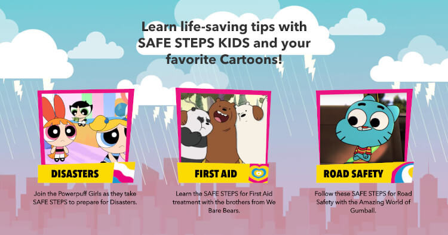
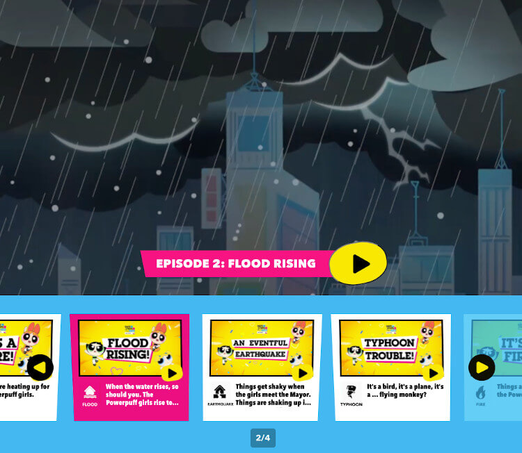
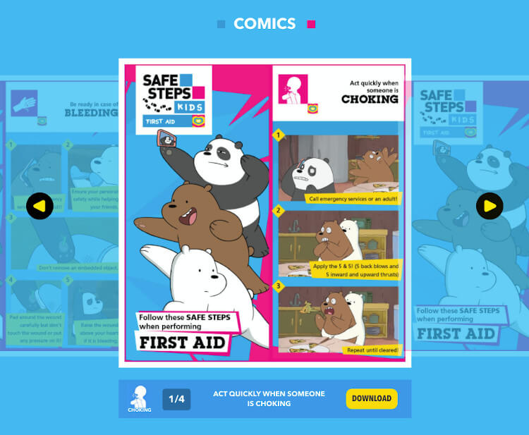
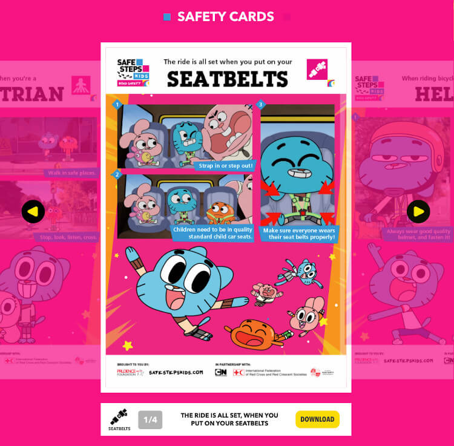
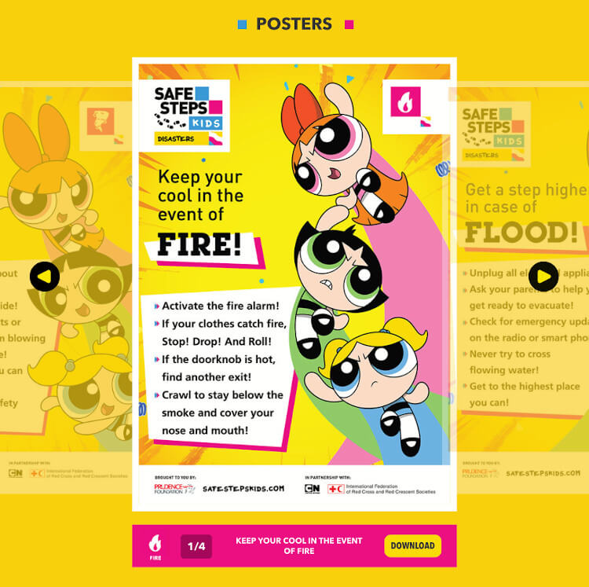
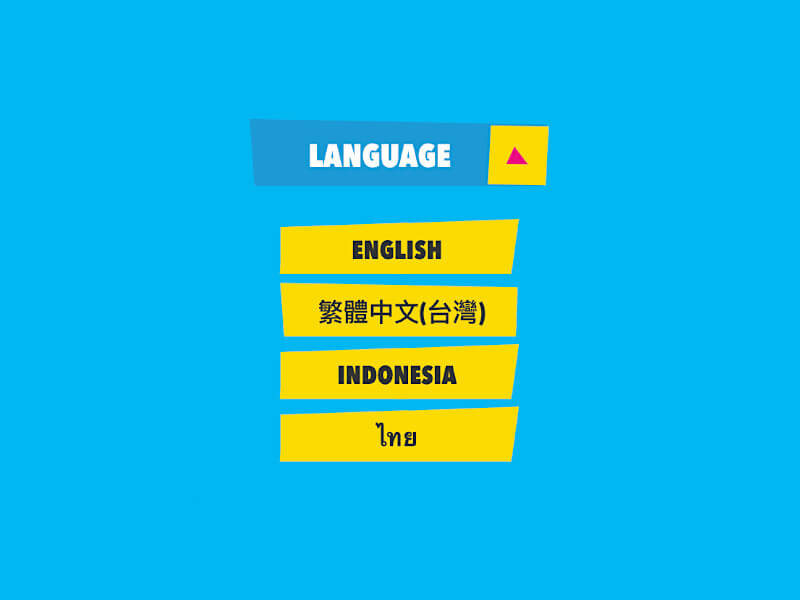

  

**SAFE STEPS KIDS** is an initiative by Prudence Foundation, in partnership with Cartoon Network and the International Federation of Red Cross and Red Crescent Societies (IFRC), that aims to education kids about safety instructions they can do when disasters strike, how they can apply first aid, and be aware about road safety.

## The Site
The website is mostly targeted for kids as well as their parents. It includes interactive, educational, and downloadable materials that bring awareness to kids in a fun way.

It features familiar characters from Cartoon Network such as **The Powerpuff Girls** for Disaster awareness, **We Bare Bears** for First Aid, and **The Amazing World of Gumball** for Road Safety awareness.

  

## Videos

We built a custom video player that features educational episodes from each cartoon.

  

## Comics

The kids can also be entertained while being informed with comic strips in this image gallery.

  

## Safety Cards

Parents can download and print these safety cards and place them in the car or the garage where the kids can see them.

  

## Posters

These posters can also be downloaded and printed. Parents can place them in their kids room or in the hallway.

  

## Multi-Language Support

The site and its materials can also be viewed and downloaded in other languages such as Bahasa Indonesia, Mandarin, and Thai.

  

## The Outcome

Equipping children with the knowledge on these precautionary measures and what to do in times of crisis is equivalent to protecting them. Explore the website and share it to your kids!

You can visit the website at [www.safestepskids.com](https://www.safestepskids.com/).

#### Credits:
* Web design by Michael Tille
* Frontend development by me
* Project of [Propelrr](https://propelrr.com/)

### If you are interested to start a project similar to this,   contact [info@propelrr.com](mailto:info@propelrr.com).

 
