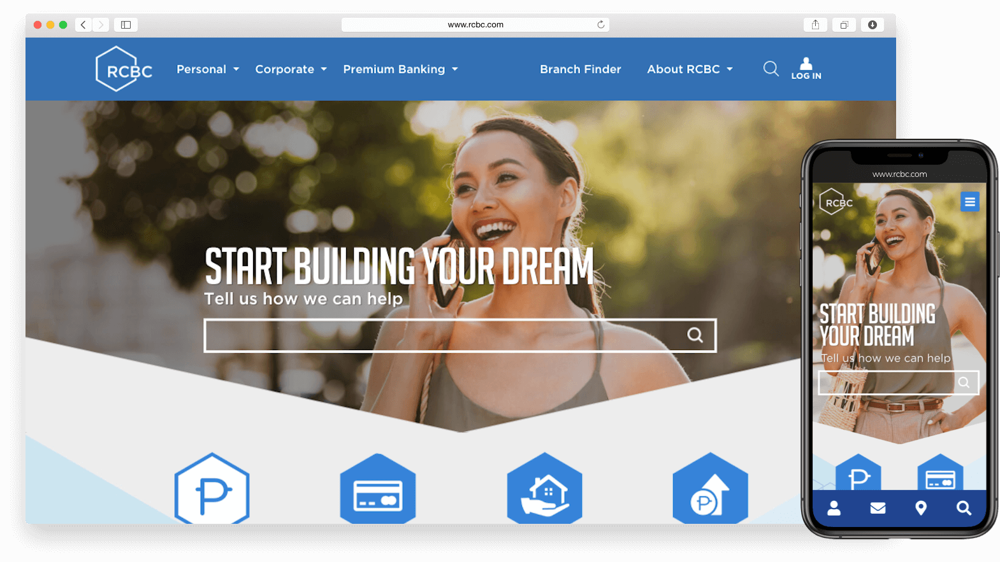
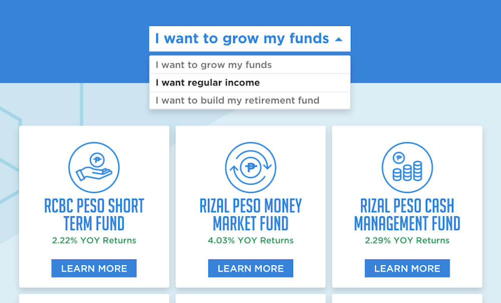
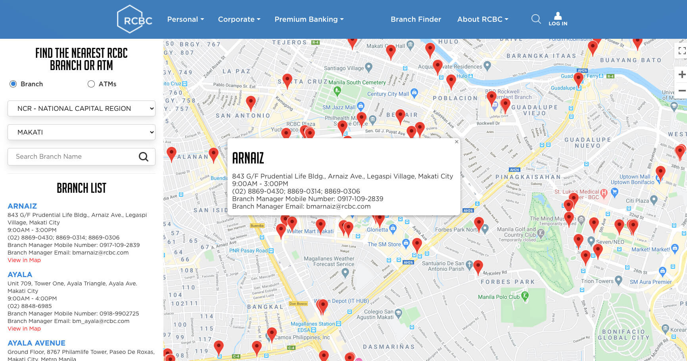

  

**Rizal Commercial Banking Corporation (RCBC)** is one of the largest and most-trusted universal banks in the Philippines. They offer personal and corporate banking and investment services.

## The Site
The website serves as an information portal to RCBC's range of financial services from setting up accounts, loan application to wealth management and online services. It also shows daily investment updates and advisories from the bank.

## Smart Search

We added a **smart search** on the home page and on the global search in the menu that automatically suggests services as the user types so that they can be instantly redirected to the respective service page.

  

## Loan Calculator

The home and auto loan pages have a loan calculator that the user can tweak so they can get an estimated projection of the total amount they can loan as well as the interest rates and monthly payment.

  

## Preference Filters

For services with different types such as insurance and investments, we added a **preference filter** so that users can easily pick from the options based on their intent.

  

## Branch Finder

RCBC currently has 480 branches and 1500 ATMs nationwide (as of November 2019). On the **branch finder** page, the user can search for the nearest branches and ATMs as well as by selecting cities or typing the branch name on the search bar. The branch finder has an interactive map with the addresses and banking hours of each branch.

  

## The Outcome

Searching for the list of available financial services, application requirements, the nearest branches and ATM locations are made easy by the RCBC website. You can save valuable time by knowing what you need to know before applying for a card, a loan, or opening an account.

You can visit the website at [www.rcbc.com](https://www.rcbc.com/).

#### Credits:
* Web design by an outsourced agency
* Frontend development by me
* Project of [Propelrr](https://propelrr.com/)

### If you are interested to start a project similar to this,   contact [info@propelrr.com](mailto:info@propelrr.com).

 
